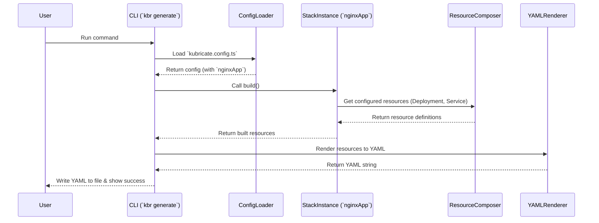

# Chapter 3: Stack

In the [previous chapter](02_project_configuration___kubricate_config_ts___.md), we learned how the `kubricate.config.ts` file acts as the central "recipe" for our project, telling the Kubricate CLI (`kbr`) which pieces of infrastructure we want to manage. One of the most important things we register in that config file are **Stacks**.

But what exactly *is* a Stack? Let's dive in!

## The Problem: Repeating Yourself (YAML Style!)

Imagine you need to deploy a simple web application to Kubernetes. Typically, this involves at least two Kubernetes resources:

1.  A **Deployment:** Manages the application's running instances (Pods) and updates.
2.  A **Service:** Gives the application a stable network address inside the cluster so other parts can talk to it.

You write the YAML for these, maybe something like this (simplified):

```yaml
# my-app-deployment.yaml
apiVersion: apps/v1
kind: Deployment
metadata:
  name: my-app
spec:
  replicas: 2
  selector:
    matchLabels:
      app: my-app
  template:
    metadata:
      labels:
        app: my-app
    spec:
      containers:
      - name: my-app-container
        image: my-company/my-app:latest
        ports:
        - containerPort: 8080
---
# my-app-service.yaml
apiVersion: v1
kind: Service
metadata:
  name: my-app-service
spec:
  selector:
    app: my-app # Must match the Deployment's labels
  ports:
  - protocol: TCP
    port: 80
    targetPort: 8080 # Must match the containerPort
```

This works fine for one app. But what happens when you need to deploy a *second* web app? Or a third? Or deploy the same app to different environments (like development, staging, production)?

You'd likely copy-paste this YAML, carefully change the `name`, `image`, maybe `replicas`, and ensure all the labels and ports still match up correctly. It's easy to make mistakes, forget to update a value, or introduce inconsistencies. This repetition is tedious and error-prone.

Wouldn't it be great if we could define this "Deployment + Service" pattern *once* and then just reuse it with different details (like app name or image)?

## Stacks: Your Reusable Kubernetes Blueprints

This is exactly what a **Stack** solves in Kubricate!

Think of a Stack as a **blueprint** or a **recipe** for a set of related Kubernetes resources that work together. It captures a common pattern, like the "web application" pattern (Deployment + Service) we just saw.

*   **Define Once:** You write the blueprint (the Stack definition) using TypeScript. This blueprint describes *how* to create the resources and which parts can be customized (like the application name or image).
*   **Use Many Times:** You then *instantiate* this blueprint with specific values for different applications or environments. Each instance represents a concrete set of resources ready to be generated.

This promotes **reuse** and **consistency**. You avoid rewriting the same YAML structures, reduce errors, and make your infrastructure definitions much easier to manage and update.

Stacks are typically defined using TypeScript classes that extend `BaseStack` or using helper functions like `createStack` provided by `@kubricate/core`.

## Creating Your First Stack: A Simple Web App

Let's create a simple Stack for our "web application" pattern (Deployment + Service).

**Goal:** Define a reusable `SimpleAppStack` that takes an application name and image name as input and generates a corresponding Deployment and Service.

**1. Define the Stack Blueprint**

First, we need `@kubricate/core` and `kubernetes-models` (for the typed Kubernetes objects):

```bash
npm install @kubricate/core kubernetes-models
```

Now, let's define the Stack. We can put this in a file like `src/stacks/simple-app-stack.ts`:

```typescript
// File: src/stacks/simple-app-stack.ts
import { BaseStack, ResourceComposer } from '@kubricate/core';
import { Deployment } from 'kubernetes-models/apps/v1'; // Typed Deployment
import { Service } from 'kubernetes-models/v1';        // Typed Service

// Define the input data our Stack needs
export interface ISimpleAppStackInput {
  appName: string;      // e.g., 'my-web-app'
  appImage: string;     // e.g., 'nginx:latest'
  replicas?: number;    // Optional: number of instances (default: 1)
  containerPort?: number; // Optional: port the container listens on (default: 80)
}

// Create a helper function that builds the resources
function configureAppResources(input: ISimpleAppStackInput) {
  const name = input.appName;
  const image = input.appImage;
  const replicas = input.replicas ?? 1; // Use ?? for default value
  const port = input.containerPort ?? 80;
  const labels = { app: name }; // Common labels for Deployment and Service

  // Use ResourceComposer to collect our Kubernetes resources
  return new ResourceComposer()
    // Add the Deployment
    .addClass({
      id: 'deployment', // An internal ID for this resource within the stack
      type: Deployment,
      config: { // The actual Deployment configuration
        metadata: { name: name },
        spec: {
          replicas: replicas,
          selector: { matchLabels: labels },
          template: {
            metadata: { labels: labels },
            spec: { containers: [{ name: name, image: image, ports: [{ containerPort: port }] }] }
          }
        }
      }
    })
    // Add the Service
    .addClass({
      id: 'service', // Another internal ID
      type: Service,
      config: { // The Service configuration
        metadata: { name: `${name}-service` }, // Naming convention
        spec: {
          selector: labels, // Connects Service to Deployment Pods
          ports: [{ port: 80, targetPort: port }]
        }
      }
    });
}

// Define the Stack class using BaseStack
export class SimpleAppStack extends BaseStack<typeof configureAppResources> {
  // The 'from' method takes our input and configures the resources
  from(input: ISimpleAppStackInput) {
    const composer = configureAppResources(input); // Call our helper
    this.setComposer(composer); // Store the configured resources
    return this; // Return the configured Stack instance
  }
}
```

Let's break this down:

*   **`ISimpleAppStackInput`:** Defines the "customizable parts" of our blueprint (app name, image, etc.) using a TypeScript interface.
*   **`configureAppResources`:** A helper function that takes the input and uses `ResourceComposer`. The [ResourceComposer](08_resourcecomposer_.md) is like a shopping cart where we add the Kubernetes resources we want. We use `.addClass()` to add typed resources (`Deployment`, `Service`) along with their configurations.
*   **`SimpleAppStack`:** Our actual Stack class. It inherits from `BaseStack`.
*   **`from(input)`:** This is the crucial method. It takes the specific configuration (`input`), calls our helper function to get the configured `ResourceComposer`, and stores it using `setComposer`.

We now have a reusable blueprint!

**2. Instantiate the Stack**

Let's create two *instances* of our `SimpleAppStack` for two different apps. We can do this in another file, maybe `src/my-apps.ts`:

```typescript
// File: src/my-apps.ts
import { SimpleAppStack } from './stacks/simple-app-stack';

// Instance 1: A simple Nginx web server
export const nginxApp = new SimpleAppStack().from({
  appName: 'web-server',
  appImage: 'nginx:1.25', // Specific image version
  replicas: 2,
});

// Instance 2: Another application
export const backendApi = new SimpleAppStack().from({
  appName: 'api-service',
  appImage: 'my-company/api:v1.1',
  containerPort: 8080, // This app uses a different port
});
```

Here, we're creating two separate, configured Stack instances: `nginxApp` and `backendApi`. Each uses the same `SimpleAppStack` blueprint but provides different values.

**3. Register in Configuration**

Now, we tell Kubricate about these instances in `kubricate.config.ts`, just like we learned in the [previous chapter](02_project_configuration___kubricate_config_ts___.md):

```typescript
// File: kubricate.config.ts
import { defineConfig } from 'kubricate';
import { nginxApp, backendApi } from './src/my-apps'; // Import our instances

export default defineConfig({
  stacks: {
    // Give each instance a unique key
    nginx: nginxApp,
    api: backendApi,
  },
  // ... other config like secrets (later chapters!)
});
```

**4. Generate the YAML**

Finally, we use the [Kubricate CLI (`kbr`)](01_kubricate_cli___kbr_____kubricate___.md) to generate the Kubernetes YAML:

```bash
npx kbr generate
```

**Output (`.kubricate/stacks.yml` - Simplified):**

Kubricate will read the config, find the `nginx` and `api` stack instances, ask each one to "build" itself using its stored `ResourceComposer`, and output the combined YAML:

```yaml
# Generated by Kubricate - DO NOT EDIT MANUALLY
# Resources from Stack instance 'nginx'
apiVersion: apps/v1
kind: Deployment
metadata:
  name: web-server # Value from nginxApp instance
  # ... other metadata added by Kubricate
spec:
  replicas: 2      # Value from nginxApp instance
  # ... rest of Deployment for web-server
---
apiVersion: v1
kind: Service
metadata:
  name: web-server-service # Value from nginxApp instance
  # ... other metadata
spec:
  # ... rest of Service for web-server (using port 80)
---
# Resources from Stack instance 'api'
apiVersion: apps/v1
kind: Deployment
metadata:
  name: api-service # Value from backendApi instance
  # ... other metadata
spec:
  replicas: 1       # Default value used in backendApi instance
  # ... rest of Deployment for api-service
---
apiVersion: v1
kind: Service
metadata:
  name: api-service-service # Value from backendApi instance
  # ... other metadata
spec:
  # ... rest of Service for api-service (using targetPort 8080)
---
```

Look at that! We defined the Deployment + Service pattern once in `SimpleAppStack` and easily generated configurations for two different applications without copying YAML.

## How Stacks Work Under the Hood

Let's peek behind the curtain. How does Kubricate take our `SimpleAppStack` instance and turn it into YAML?

**High-Level Flow:**

1.  **`kbr generate` runs:** You execute the command.
2.  **Load Config:** The CLI loads `kubricate.config.ts`.
3.  **Find Stacks:** It finds the `stacks` object and iterates through the registered instances (`nginxApp`, `backendApi`).
4.  **Inject Logger (Internal):** Kubricate injects a logger into the Stack instance for internal diagnostics.
5.  **Build Stack:** For each Stack instance, Kubricate calls its `build()` method (inherited from `BaseStack`).
6.  **Compose Resources:** The `build()` method typically uses the stored [ResourceComposer](08_resourcecomposer_.md) to gather all the Kubernetes resource definitions (`Deployment`, `Service`) that were added using `.addClass()`. If secrets are involved (covered later), it also performs secret injection at this stage.
7.  **Render YAML:** Kubricate takes the collected resource definitions from all Stacks and renders them into a single YAML string (or multiple files, depending on configuration).
8.  **Write Output:** The final YAML is written to the output directory (e.g., `.kubricate/stacks.yml`).

**Sequence Diagram:**

Here's a simplified view of the process for one Stack instance:



**Code Dive:**

*   **`BaseStack`:** This is the foundation (`packages/core/src/BaseStack.ts`). It provides the core structure, including the `_composer` property to hold the configured resources and the `build()` method logic.

    ```typescript
    // File: packages/core/src/BaseStack.ts (Simplified)
    import { ResourceComposer } from './ResourceComposer.js';
    // ... other imports

    export abstract class BaseStack<...> {
      public _composer!: ResourceComposer; // Holds the configured resources

      // Abstract method: Subclasses MUST implement 'from' to configure the composer
      abstract from(data: unknown): unknown;

      // Sets the ResourceComposer instance after configuration
      public setComposer(composer: ResourceComposer) {
        this._composer = composer;
      }

      // Builds the final list of resources from the composer
      build() {
        // ... (logic for handling secrets injection, if any) ...

        // Ask the composer to finalize and return all resources
        return this._composer.build();
      }

      // ... other methods like useSecrets, injectLogger, etc.
    }
    ```
    The key parts are `setComposer` (called by *your* `from` method) and `build` (called by Kubricate CLI).

*   **`createStack` (Alternative):** Instead of creating a class, you can use the `createStack` helper function (`packages/core/src/createStack.ts`). It's often simpler for basic Stacks.

    ```typescript
    // File: packages/core/src/createStack.ts (Simplified)
    import { GenericStack } from './BaseStack.js'; // Uses a generic base class
    import type { ResourceComposer } from './ResourceComposer.js';

    // The function you pass to createStack
    export type ConfigureComposerFunction<Data, ...> = (data: Data) => ResourceComposer<...>;

    // Factory function
    export function createStack<Data, ...>(
      name: string, // Give the stack type a name
      builder: ConfigureComposerFunction<Data, ...> // Your function that returns a ResourceComposer
    ) {
      // Returns an object with a 'from' method
      return {
        from(data: Data) {
          // Creates an internal Stack instance, calls your builder, sets the composer
          const stack = new GenericStack<Data, ...>(builder);
          stack.setName(name);
          return stack.from(data); // Calls the internal 'from' which uses your builder
        },
      };
    }
    ```
    This factory wraps the logic of creating a `BaseStack` instance and calling your configuration function inside its `from` method. The example from Chapter 2 used `createStack`.

*   **`ResourceComposer`:** This class (`packages/core/src/ResourceComposer.ts`) is responsible for holding the definitions of the resources you add via `.addClass()` or other methods. The `build()` method in `BaseStack` ultimately relies on the composer's `build()` method to get the final list of resource objects ready for rendering. We'll explore the [ResourceComposer](08_resourcecomposer_.md) in more detail in a later chapter.

## Benefits of Using Stacks

*   **Reusability:** Define common patterns once, use them everywhere.
*   **Consistency:** Ensures applications are deployed using the same tested structures.
*   **Type Safety:** TypeScript catches errors in your infrastructure definitions *before* you deploy. Refactoring is much safer.
*   **Maintainability:** Changes to a pattern (e.g., adding a standard label) are made in one place (the Stack definition).
*   **Abstraction:** Hides the complexity of underlying Kubernetes YAML from users of the Stack.

## Conclusion

You've learned that a **Stack** in Kubricate is a fundamental concept for building reusable, type-safe Kubernetes configurations. It acts as a blueprint for related resources, allowing you to define patterns like "web application" once and instantiate them multiple times with different configurations.

We saw how to:

1.  Define a Stack using TypeScript (`BaseStack` or `createStack`).
2.  Use the [ResourceComposer](08_resourcecomposer_.md) to add Kubernetes resources (like `Deployment` and `Service`) to the Stack blueprint.
3.  Instantiate the Stack with specific inputs (e.g., `appName`, `appImage`).
4.  Register Stack instances in `kubricate.config.ts`.
5.  Use `kbr generate` to turn these instances into standard Kubernetes YAML.

Stacks are the building blocks of your infrastructure in Kubricate. But applications often need more than just Deployments and Services – they need configuration and sensitive information (secrets). How do we manage those safely with Kubricate? That's what we'll explore next.

**Next:** [Chapter 4: SecretManager](04_secretmanager_.md)

---

Generated by [AI Codebase Knowledge Builder](https://github.com/The-Pocket/Tutorial-Codebase-Knowledge)