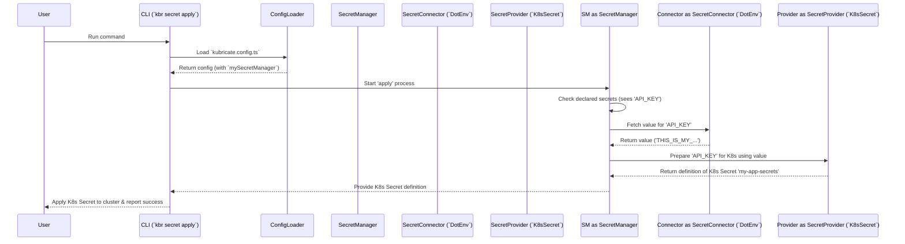

# Chapter 4: SecretManager

In the [previous chapter](03_stack_.md), we learned how [Stacks](03_stack_.md) help us create reusable blueprints for our Kubernetes resources like Deployments and Services. This is great for organizing our application structure!

But what about sensitive information? Our applications often need things like database passwords, API keys, or security tokens. We definitely *don't* want to write these directly into our [Stack](03_stack_.md) code or the generated YAML files. That would be insecure and make managing updates a nightmare!

This is where the `SecretManager` comes in.

## The Problem: Handling Secrets Safely

Let's go back to the simple web application we built a [Stack](03_stack_.md) for. Imagine this application needs to talk to an external weather service, and that service requires an `API_KEY`.

How do we give this `API_KEY` to our application running in Kubernetes?

*   **Bad Idea 1: Hardcode it in the code.** If the key changes, we have to rebuild and redeploy the entire application. It's also visible to anyone who can see the source code.
*   **Bad Idea 2: Put it directly in the Deployment YAML.** This is slightly better, but the key is still stored in plain text in our configuration files (maybe even committed to Git!). Anyone with access to the repository can see it.
*   **Better Idea:** Use Kubernetes `Secret` objects. These are designed to hold sensitive data. But how do we create and manage these `Secret` objects without manually writing YAML for each one? And where do the actual secret *values* come from?

We need a way to:

1.  Declare that our application *needs* an `API_KEY`.
2.  Specify *where* to securely get the actual value of the `API_KEY` (e.g., from a local `.env` file for development, or a cloud secret store like Azure Key Vault for production).
3.  Define *how* this secret should be made available to our application in Kubernetes (e.g., by creating a Kubernetes `Secret` object).
4.  Do all of this without ever hardcoding the secret value in our infrastructure code.

## SecretManager: Your Project's Secret Coordinator

Think of the `SecretManager` as the **central coordinator** or the **secretary** for all secrets *within your Kubricate project*. It doesn't usually store the secrets itself, but it knows everything about them: what's needed, where to find the values, and how to deliver them.

Here's what the `SecretManager` helps you orchestrate:

1.  **Declare Needs:** You tell the `SecretManager`, "My project needs secrets named `API_KEY` and `DB_PASSWORD`." This creates a clear inventory of required sensitive information.
2.  **Register Fetchers ([SecretConnectors](05_secretconnector_.md)):** You tell the `SecretManager`, "To get the actual values for these secrets, you can use this method (e.g., read from an `.env` file) or that method (e.g., fetch from Azure Key Vault)." These methods are called **Connectors**. We'll learn more about them in the [next chapter](05_secretconnector_.md).
3.  **Define Delivery ([SecretProviders](06_secretprovider_.md)):** You tell the `SecretManager`, "Once you have the secret values, present them to Kubernetes like this (e.g., create a Kubernetes `Secret` object)." These delivery mechanisms are called **Providers**. We'll explore them in detail in [Chapter 6](06_secretprovider_.md).

The `SecretManager` sits in the middle, connecting your *declarations* (what you need) to your *Connectors* (where to get it) and *Providers* (how to deliver it).

This approach keeps your actual secret values separate from your infrastructure code, making your setup more secure, consistent, and easier to manage across different environments.

## Using the SecretManager: A Simple Example

Let's configure a `SecretManager` to handle the `API_KEY` for our weather service application.

**Goal:** Declare the need for `API_KEY`, configure it to be fetched from a local `.env` file, and delivered as a standard Kubernetes `Secret` object.

**Step 1: Create a `SecretManager` Instance**

First, we need to install the necessary Kubricate packages if we haven't already. We'll need `@kubricate/core` and potentially specific connector/provider packages (like `@kubricate/env` and `@kubricate/kubernetes`).

```bash
npm install @kubricate/core @kubricate/env @kubricate/kubernetes
```

Now, let's create an instance in a file, maybe `src/my-secrets.ts`:

```typescript
// File: src/my-secrets.ts
import { SecretManager } from '@kubricate/core';

// Create a new, empty SecretManager instance
export const mySecretManager = new SecretManager();
```

This creates the central coordinator object. It's empty for now.

**Step 2: Register a Connector (The Fetcher)**

We need to tell the `SecretManager` *how* to get the secret values. For development, let's use a connector that reads from a `.env` file in our project root.

> **Note:** We'll cover [SecretConnectors](05_secretconnector_.md) in detail in the next chapter. This is just a quick preview!

```typescript
// File: src/my-secrets.ts (continued)
import { SecretManager } from '@kubricate/core';
import { EnvConnector } from '@kubricate/env'; // Import the .env connector

export const mySecretManager = new SecretManager()
  // Register a connector instance named 'DotEnv'
  .addConnector('DotEnv', new EnvConnector());
```

We've added a way for the `SecretManager` to fetch secrets, specifically by looking in a `.env` file.

**Step 3: Register a Provider (The Deliverer)**

Next, we tell the `SecretManager` *how* to make the secret available in Kubernetes. Let's use a provider that creates a standard Kubernetes `Secret` object.

> **Note:** We'll cover [SecretProviders](06_secretprovider_.md) in detail in Chapter 6. Another quick preview!

```typescript
// File: src/my-secrets.ts (continued)
import { SecretManager } from '@kubricate/core';
import { EnvConnector } from '@kubricate/env';
import { OpaqueSecretProvider } from '@kubricate/kubernetes/providers'; // Import a provider

export const mySecretManager = new SecretManager()
  .addConnector('DotEnv', new EnvConnector())
  // Register a provider instance named 'K8sSecret'
  // This one will create a K8s Secret named 'my-app-secrets'
  .addProvider('K8sSecret', new OpaqueSecretProvider({ name: 'my-app-secrets' }));
```

Now the `SecretManager` knows *how* to deliver the secrets it finds.

**Step 4: Declare the Secret Need**

This is where we list the secrets our project requires.

```typescript
// File: src/my-secrets.ts (continued)
import { SecretManager } from '@kubricate/core';
import { EnvConnector } from '@kubricate/env';
import { OpaqueSecretProvider } from '@kubricate/kubernetes/providers';

export const mySecretManager = new SecretManager()
  .addConnector('DotEnv', new EnvConnector())
  .addProvider('K8sSecret', new OpaqueSecretProvider({ name: 'my-app-secrets' }))
  // Declare that we need a secret named 'API_KEY'
  .addSecret({ name: 'API_KEY' });
  // You can add more secrets here!
  // .addSecret({ name: 'DB_PASSWORD' });
```

We've told our "secretary" to add `API_KEY` to its checklist. By default, it will use the registered `DotEnv` connector to find the value and the `K8sSecret` provider to deliver it. You can explicitly specify connectors and providers per secret if needed.

**Step 5: Register in `kubricate.config.ts`**

Just like we registered our [Stacks](03_stack_.md) in the [Project Configuration](02_project_configuration___kubricate_config_ts___.md), we need to tell Kubricate about our `SecretManager`.

```typescript
// File: kubricate.config.ts
import { defineConfig } from 'kubricate';
// Assuming your Stack instance is defined elsewhere
import { myAppStack } from './src/my-app-stack';
// Import the SecretManager instance we just created
import { mySecretManager } from './src/my-secrets';

export default defineConfig({
  stacks: {
    // Your application stack(s)
    app: myAppStack,
  },

  // The 'secret' section is for secret management configuration
  secret: {
    // Register our SecretManager instance
    manager: mySecretManager,
  },
});
```

Now, Kubricate knows which `SecretManager` to use when handling secrets.

**Step 6: Use the CLI**

Remember the `kbr secret` commands from [Chapter 1](01_kubricate_cli___kbr_____kubricate___.md)? Now they become useful!

First, make sure you have a `.env` file in your project root with the secret value:

```dotenv
# File: .env
API_KEY=THIS_IS_MY_SUPER_SECRET_KEY_12345
```

Now, let's use the CLI:

1.  **Validate:** Check if the declared secrets exist in their sources.

    ```bash
    npx kbr secret validate
    ```

    *   **What happens:** Kubricate finds `mySecretManager`, sees the `API_KEY` declaration, uses the `DotEnv` connector to check the `.env` file. If `API_KEY` is found, it reports success. If not, it gives an error.

2.  **Apply:** Fetch the secret values and use the providers to make them available.

    ```bash
    npx kbr secret apply
    ```

    *   **What happens:** Kubricate finds `mySecretManager`. It uses the `DotEnv` connector to *fetch* the value of `API_KEY` from `.env`. Then, it uses the `K8sSecret` provider (`OpaqueSecretProvider`) which generates the definition for a Kubernetes `Secret` object named `my-app-secrets` containing the fetched `API_KEY`. Finally, Kubricate (often via `kubectl` internally) applies this `Secret` object to your Kubernetes cluster (or generates the YAML if run with `--dry-run`).

**Outcome:** After `kbr secret apply`, there will be a Kubernetes `Secret` resource in your cluster named `my-app-secrets`, containing the `API_KEY`. Your application's [Stack](03_stack_.md) can then be configured to read this Kubernetes `Secret` (we'll see how [Stacks](03_stack_.md) can consume secrets generated by providers in later chapters).

We successfully managed our `API_KEY` without hardcoding it in our infrastructure code!

## How SecretManager Works Under the Hood

Let's visualize the `kbr secret apply` flow:



**Code Dive:**

*   **`SecretManager` Class (`packages/core/src/secret/SecretManager.ts`):**
    This class holds the core logic. It maintains internal lists/maps of registered connectors, providers, and declared secrets.

    ```typescript
    // File: packages/core/src/secret/SecretManager.ts (Simplified)
    import type { BaseConnector } from './connectors/BaseConnector.js';
    import type { BaseProvider } from './providers/BaseProvider.js';
    // ... other imports

    export class SecretManager<...> {
      private _secrets: Record<string, SecretOptions> = {}; // Stores declared secrets
      private _providers: Record<string, BaseProvider> = {}; // Stores provider instances
      private _connectors: Record<string, BaseConnector> = {}; // Stores connector instances
      private _defaultProvider: string | undefined;
      private _defaultConnector: string | undefined;
      // ... logger

      addProvider<N extends string, P extends BaseProvider>(name: N, instance: P) {
        // ... (error checks)
        this._providers[name] = instance;
        // ... (return typed instance)
      }

      addConnector<N extends string, C extends BaseConnector>(name: N, instance: C) {
        // ... (error checks)
        this._connectors[name] = instance;
        // ... (return typed instance)
      }

      addSecret<N extends string>(optionsOrName: N | SecretOptions<N>) {
        const name = typeof optionsOrName === 'string' ? optionsOrName : optionsOrName.name;
        // ... (error checks)
        this._secrets[name] = typeof optionsOrName === 'string'
          ? { name } // Simple declaration
          : optionsOrName; // Declaration with specific connector/provider
        // ... (return typed instance)
      }

      // Internal method called before operations like validate/apply
      build() {
        // Checks if defaults are needed and sets them if only one option exists
        // Ensures all declarations are valid before proceeding
        // ... logic to set default provider/connector if needed ...
        this.prepareSecrets(); // Ensures all secrets have provider/connector assigned
        this.logger?.debug('SecretManager built and validated.');
      }

      // Internal helper to assign defaults if not specified
      private prepareSecrets() {
        for (const secret of Object.values(this._secrets)) {
          secret.provider ??= this._defaultProvider;
          secret.connector ??= this._defaultConnector;
        }
      }

      // Used internally by CLI commands or other parts of Kubricate
      async resolveSecretValueForApply(secretName: string): Promise<{...}> {
        const secret = this._secrets[secretName];
        // ... (error checks)
        const connector = this.resolveConnector(secret.connector); // Find the right connector
        await connector.load([secretName]); // Ask connector to load the value
        const value = connector.get(secretName); // Get the loaded value
        const provider = this.resolveProvider(secret.provider); // Find the right provider
        return { provider, value };
      }

      // ... other methods like resolveProvider, resolveConnector, getSecrets, etc.
    }
    ```
    The key takeaway is that `SecretManager` acts as a registry, holding references to the connectors and providers you add, and the list of secrets you declare. Methods like `resolveSecretValueForApply` orchestrate the interaction between these components when commands like `kbr secret apply` are executed.

## Conclusion

The `SecretManager` is your central hub for managing sensitive information within your Kubricate project. It doesn't store secrets directly, but it orchestrates how they are handled:

*   You **declare** the secrets your application needs (e.g., `API_KEY`).
*   You register **[SecretConnectors](05_secretconnector_.md)** to tell it *where* to fetch the actual values (like from `.env` files or cloud vaults).
*   You register **[SecretProviders](06_secretprovider_.md)** to tell it *how* to deliver those secrets to Kubernetes (like creating K8s `Secret` objects).

This separation provides a secure, consistent, and manageable way to handle secrets without hardcoding them, bridging the gap between your application's needs and your secret storage solutions.

Now that we understand the role of the `SecretManager` as the coordinator, let's dive deeper into the first piece it manages: the **Connectors** that fetch secret values.

**Next:** [Chapter 5: SecretConnector](05_secretconnector_.md)

---

Generated by [AI Codebase Knowledge Builder](https://github.com/The-Pocket/Tutorial-Codebase-Knowledge)