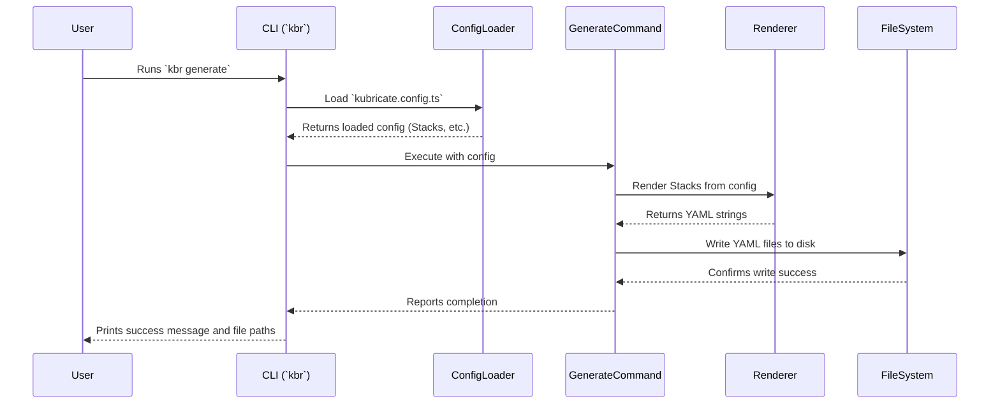

# Chapter 1: Kubricate CLI (`kbr` / `kubricate`)

Welcome to the Kubricate tutorial! 🎉 We're excited to help you learn how to manage your Kubernetes configurations in a more organized, type-safe, and less error-prone way using TypeScript.

In this first chapter, we'll introduce the main tool you'll use to interact with Kubricate: the Command-Line Interface (CLI), which you can call using either `kubricate` or its shorter alias, `kbr`.

## What is the Kubricate CLI and Why Do I Need It?

Imagine you're building something complex, like a model airplane or wiring a smart home. You wouldn't just start connecting wires or gluing pieces randomly, right? You'd likely have blueprints (your definitions) and a set of tools (like screwdrivers, pliers, glue) to actually build it according to the plan.

In the world of Kubricate, your TypeScript code defines the "blueprints" for your Kubernetes infrastructure ([Stacks](03_stack_.md)) and how secrets should be handled ([SecretManager](04_secretmanager_.md), [SecretConnector](05_secretconnector_.md), [SecretProvider](06_secretprovider_.md)).

The **Kubricate CLI (`kbr` or `kubricate`)** is your primary set of "tools". It's the command center, the control panel you use to take those TypeScript blueprints and turn them into actual instructions that Kubernetes can understand (like YAML files) or to manage the lifecycle of your secrets.

You'll use the CLI for key tasks like:

1.  **Generating Manifests:** Taking your TypeScript [Stack](03_stack_.md) definitions and converting them into standard Kubernetes YAML files.
2.  **Managing Secrets:** Validating that your secrets exist where they should and applying them according to your [SecretManager](04_secretmanager_.md) setup.

Think of the CLI as the bridge between your developer-friendly TypeScript code and the world of Kubernetes configurations and secrets management.

## Your First Commands: `generate` and `secret`

Let's look at the most common commands you'll use. Don't worry about understanding *everything* they do right now; we'll cover the details in later chapters. The goal here is to see *how* you interact with Kubricate.

### Generating Kubernetes YAML

The most fundamental command is `generate`. It reads your project's configuration, finds your [Stack](03_stack_.md) definitions, and produces the corresponding Kubernetes YAML files.

```bash
# Make sure you have kubricate installed in your project
# npm install -D kubricate @kubricate/core

# Run the generate command using npx
npx kubricate generate

# Or use the shorter alias 'kbr'
npx kbr generate
```

After running this, Kubricate will typically create a `.kubricate` folder (or another configured output directory) containing YAML files ready to be applied to your Kubernetes cluster (e.g., using `kubectl apply -f .kubricate/stacks.yml`).

*   **Input:** Your TypeScript code defining [Stacks](03_stack_.md) and your [Project Configuration (`kubricate.config.ts`)](02_project_configuration___kubricate_config_ts___.md).
*   **Output:** Kubernetes YAML files written to disk (or printed to the console if you use the `--stdout` option).

### Managing Secrets

Kubricate also helps manage secrets declaratively. The `secret` command group has subcommands like `validate` and `apply`.

*   **`kbr secret validate`**: This command checks if the secrets you've declared in your [SecretManager](04_secretmanager_.md) actually exist in the configured sources ([SecretConnectors](05_secretconnector_.md)) and are ready for use by their targets ([SecretProviders](06_secretprovider_.md)). It's like double-checking you have all the right keys before trying to open doors.

    ```bash
    npx kbr secret validate
    ```

*   **`kbr secret apply`**: This command takes the secrets from your sources (like an `.env` file or Azure Key Vault, defined via [SecretConnectors](05_secretconnector_.md)) and applies them to your targets (like creating Kubernetes `Secret` objects, defined via [SecretProviders](06_secretprovider_.md)). It's the action of actually *using* the keys to create or update the locks.

    ```bash
    npx kbr secret apply
    ```

These commands interact with your [SecretManager](04_secretmanager_.md) configuration to ensure your application's secrets are correctly handled before deployment.

## How Does the CLI Work Under the Hood?

You don't need to know the deep internals to use Kubricate effectively, but a little insight can be helpful! When you run a `kbr` command, here's a simplified view of what happens:

1.  **Parse Command:** The CLI (using a library called `yargs`) figures out which command you ran (`generate`, `secret validate`, etc.) and any options you provided (like `--outDir` or `--verbose`).
2.  **Load Configuration:** It looks for your `kubricate.config.ts` file (we'll cover this in the [next chapter](02_project_configuration___kubricate_config_ts___.md)). This file tells Kubricate where to find your [Stacks](03_stack_.md) and [SecretManager](04_secretmanager_.md) definitions.
3.  **Initialize Core Components:** Based on the configuration, it sets up the necessary parts of Kubricate, like loading your Stack instances or initializing the [SecretsOrchestrator](07_secretsorchestrator_.md).
4.  **Execute Command Logic:** It runs the specific code associated with your command.
    *   For `generate`, it uses the [ResourceComposer](08_resourcecomposer_.md) within your Stacks to gather all Kubernetes resource definitions and then renders them into YAML strings.
    *   For `secret validate` or `secret apply`, it uses the [SecretsOrchestrator](07_secretsorchestrator_.md) to interact with your defined [SecretConnectors](05_secretconnector_.md) and [SecretProviders](06_secretprovider_.md).
5.  **Provide Feedback:** The CLI prints messages to your console, telling you what it's doing, whether it succeeded, or if any errors occurred. If generating files, it writes them to the specified output directory.

Here's a simple diagram illustrating the flow for the `kbr generate` command:



### A Glimpse into the Code

Let's peek at how the CLI is structured internally.

The entry point (`packages/kubricate/src/cli.ts`) sets things up:

```typescript
// File: packages/kubricate/src/cli.ts (Simplified)
import { cliEntryPoint } from './cli-interfaces/entrypoint.js';
import { version } from './version.js';

// Start the command-line interface logic
cliEntryPoint(process.argv, { // process.argv contains command line arguments
  version,
  scriptName: 'kbr', // Sets the name you see in help messages
})
// ... error handling ...
```

This calls `cliEntryPoint` (`packages/kubricate/src/cli-interfaces/entrypoint.ts`) which uses `yargs` to define commands and options:

```typescript
// File: packages/kubricate/src/cli-interfaces/entrypoint.ts (Simplified)
import yargs from 'yargs';
import { generateCommand } from './generate.js';
import { secretCommand } from './secret/index.js';

export function cliEntryPoint(argv: string[], options: CliEntryPointOptions): Promise<void> {
  return new Promise((resolve, reject) => {
    yargs(hideBin(argv)) // Use yargs to parse arguments
      .scriptName(options.scriptName)
      .version(options.version)
      // Define global options like --config, --verbose
      .option('config', { type: 'string', describe: 'Config file path' })
      // Define commands
      .command(generateCommand) // Register the 'generate' command
      .command(secretCommand)   // Register the 'secret' command group
      .help() // Enable --help
      .demandCommand(1, '') // Require at least one command
      .parse(); // Start parsing!
  });
}
```

Each command, like `generate`, is defined in its own file (`packages/kubricate/src/cli-interfaces/generate.ts`):

```typescript
// File: packages/kubricate/src/cli-interfaces/generate.ts (Simplified)
import type { CommandModule } from 'yargs';
import { GenerateCommand } from '../commands/generate/index.js';
import { ConfigLoader } from '../commands/ConfigLoader.js';

// Define the 'generate' command details for yargs
export const generateCommand: CommandModule = {
  command: 'generate',
  describe: 'Generate a stack into yaml files',
  builder: yargs => // Define options specific to 'generate'
    yargs
      .option('outDir', { /* ... */ })
      .option('stdout', { /* ... */ }),
  handler: async (argv) => { // This function runs when 'generate' is called
    // 1. Load configuration
    const configLoader = new ConfigLoader(argv, argv.logger);
    const { config } = await configLoader.initialize(/* ... */);

    // 2. Execute the core logic
    await new GenerateCommand(argv, argv.logger).execute(config);
  },
};
```

The `handler` function is where the real work starts for that specific command, typically by loading the configuration and then instantiating and running a dedicated command class (like `GenerateCommand`).

## Conclusion

You've now met the Kubricate CLI (`kbr` or `kubricate`), your main tool for interacting with the Kubricate framework. You learned that it acts as a control panel, allowing you to:

*   Generate Kubernetes YAML from your TypeScript [Stacks](03_stack_.md) using `kbr generate`.
*   Manage secrets using commands like `kbr secret validate` and `kbr secret apply`, driven by your [SecretManager](04_secretmanager_.md) setup.

The CLI reads your project's configuration, orchestrates the necessary actions, and provides feedback. It's the essential link between your code and the operational aspects of Kubernetes deployment and secret handling.

In the next chapter, we'll dive into the heart of how Kubricate knows what to do: the project configuration file.

**Next:** [Chapter 2: Project Configuration (`kubricate.config.ts`)](02_project_configuration___kubricate_config_ts___.md)

---

Generated by [AI Codebase Knowledge Builder](https://github.com/The-Pocket/Tutorial-Codebase-Knowledge)