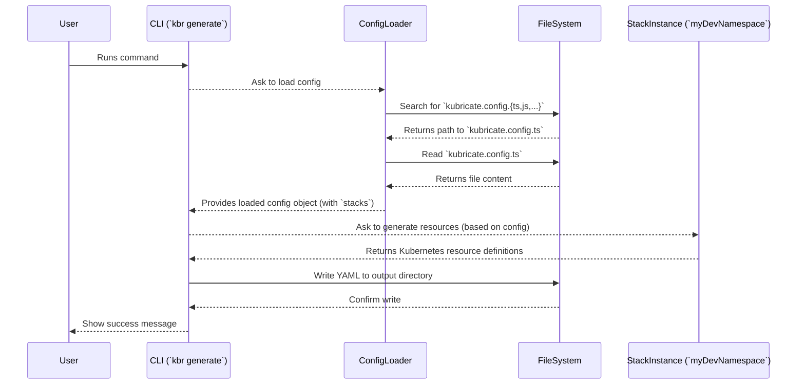

# Chapter 2: Project Configuration (`kubricate.config.ts`)

In the [previous chapter](01_kubricate_cli___kbr_____kubricate___.md), we met the Kubricate Command Line Interface (CLI), our main tool for interacting with Kubricate. We saw how commands like `kbr generate` can turn our TypeScript code into Kubernetes YAML. But how does the `kbr` command know *which* code to look at? How does it know what we want to build?

That's where the project configuration file comes in!

## The Recipe for Your Project: `kubricate.config.ts`

Imagine you're baking a cake. You have ingredients (your code defining Kubernetes resources or secrets) and tools (the `kbr` CLI). But you also need a **recipe** that tells you exactly which ingredients to use, in what amounts, and what the final cake should look like.

The `kubricate.config.ts` file is the **recipe** for your Kubricate project. It's the central place where you tell the Kubricate CLI (`kbr`) everything it needs to know about your specific setup.

Think of it as the main settings file or the control document for your infrastructure defined with Kubricate.

## What Does the Config File Do?

The `kubricate.config.ts` file primarily does three things:

1.  **Registers Your Stacks:** It lists all the [Stacks](03_stack_.md) (groups of Kubernetes resources) that you want Kubricate to manage and generate. This is like listing the main components of your cake in the recipe.
2.  **Configures Secret Handling:** It tells Kubricate how to manage sensitive information (secrets) using the [SecretManager](04_secretmanager_.md). You define where secrets come from ([SecretConnectors](05_secretconnector_.md)) and how they should be prepared for Kubernetes ([SecretProviders](06_secretprovider_.md)). This is like specifying how to handle delicate ingredients like chocolate or eggs.
3.  **Sets Generation Options:** You can specify details about how Kubricate should generate files, like which directory the output YAML should go into. This is like noting down the baking temperature and time.

When you run a `kbr` command, the *first* thing it usually does is look for this `kubricate.config.ts` file to understand your project's structure and intentions.

## Your First Configuration: Registering a Stack

Let's start with the most common use case: telling Kubricate about a [Stack](03_stack_.md) you want to generate.

First, you need a Stack defined somewhere in your project. Let's imagine a very simple Stack that creates a Kubernetes Namespace (don't worry too much about the Stack code itself yet; we'll cover that in the [next chapter](03_stack_.md)).

```typescript
// File: src/my-namespace-stack.ts
import { createStack, ResourceComposer } from '@kubricate/core';
import { Namespace } from 'kubernetes-models/v1'; // Needs `npm install kubernetes-models`

// Define a simple Stack that creates one Namespace resource
const NamespaceStack = createStack('NamespaceStack', (input: { name: string }) =>
  new ResourceComposer().addClass({
    type: Namespace,
    config: { metadata: { name: input.name } },
  })
);

// Create an instance of the Stack with specific configuration
export const myDevNamespace = NamespaceStack.from({
  name: 'my-development-ns',
});
```

This code defines a reusable `NamespaceStack` and then creates a specific instance called `myDevNamespace` that will create a namespace named `my-development-ns`.

Now, how do we tell Kubricate about `myDevNamespace`? We use `kubricate.config.ts`:

```typescript
// File: kubricate.config.ts (at the root of your project)
import { defineConfig } from 'kubricate'; // Helper function from Kubricate
import { myDevNamespace } from './src/my-namespace-stack'; // Import our Stack instance

// Use defineConfig to create the configuration object
export default defineConfig({
  // The 'stacks' property is where we register our Stack instances
  stacks: {
    // We give our stack instance a unique key ('devNamespace' here)
    // and assign the imported instance to it.
    devNamespace: myDevNamespace,
    // You can add more stacks here!
    // anotherStack: someOtherStackInstance,
  },

  // We can also configure secrets and generation options here (more later!)
  // secret: { ... },
  // generate: { outDir: './generated-k8s' }
});
```

Let's break down this `kubricate.config.ts` file:

1.  **`import { defineConfig } from 'kubricate';`**: We import a helper function called `defineConfig`. This function doesn't *do* much by itself, but it provides type safety and autocompletion in your code editor, making it easier to write the config correctly.
2.  **`import { myDevNamespace } from './src/my-namespace-stack';`**: We import the actual Stack instance we created in the other file.
3.  **`export default defineConfig({ ... });`**: We export the configuration object as the default export. This is how Kubricate finds it.
4.  **`stacks: { ... }`**: This is the crucial part for now. It's an object where you list all the Stack instances you want Kubricate to manage.
5.  **`devNamespace: myDevNamespace`**: Inside `stacks`, we give our Stack instance a *logical name* or *ID* (here, `devNamespace`). This ID is used internally by Kubricate and might appear in logs or generated metadata. We assign our imported `myDevNamespace` instance to this key.

Now, when you run:

```bash
npx kbr generate
```

Kubricate will:

1.  Find `kubricate.config.ts`.
2.  Read the `stacks` object.
3.  See the `devNamespace` entry pointing to `myDevNamespace`.
4.  Ask the `myDevNamespace` Stack instance to generate its Kubernetes resources (in this case, the `my-development-ns` Namespace).
5.  Write the resulting YAML to the output directory (usually `.kubricate/stacks.yml`).

**Output (`.kubricate/stacks.yml`):**

```yaml
# Generated by Kubricate - DO NOT EDIT MANUALLY
apiVersion: v1
kind: Namespace
metadata:
  # Metadata like labels/annotations might be added by Kubricate automatically
  name: my-development-ns
  # ... other potential metadata
---
```

So, the `kubricate.config.ts` file acted as the bridge connecting the `kbr generate` command to your actual Stack definition!

## Configuring Secrets and Generation (A Sneak Peek)

While we focused on `stacks`, the config file is also where you'll set up more advanced features later:

```typescript
// File: kubricate.config.ts (Example showing other options)
import { defineConfig } from 'kubricate';
import { myDevNamespace } from './src/my-namespace-stack';
// Imagine we also have a SecretManager defined somewhere
import { mySecretManager } from './src/my-secrets';

export default defineConfig({
  stacks: {
    devNamespace: myDevNamespace,
  },

  // Configure secret management (we'll cover this in Chapter 4!)
  secret: {
    manager: mySecretManager, // Register the SecretManager instance
    // Other secret options...
  },

  // Configure generation options
  generate: {
    outDir: './my-kube-yaml', // Change the output directory
    outputFormat: 'yaml', // Specify output format (default is yaml)
  },

  // Configure automatic metadata injection
  metadata: {
    inject: true, // Add labels like 'stack-id' (default: true)
    injectResourceHash: false, // Don't add resource hash annotation
  }
});
```

This example shows how you'd register a [SecretManager](04_secretmanager_.md) instance under the `secret` key and customize the output directory using the `generate` key. We'll explore these options in detail in their respective chapters.

## How Kubricate Finds and Uses the Config

When you run a `kbr` command, how does it actually find and use this file?

1.  **Search:** The CLI looks for a file named `kubricate.config.ts` (or `.js`, `.mjs`, etc.) in your current working directory (or a directory specified with `--root`). It uses a library called `unconfig` to handle this search robustly.
2.  **Load:** Once found, it loads the file. Since it's TypeScript, it might be compiled on-the-fly.
3.  **Parse:** It accesses the `default export` of the file, expecting the configuration object we defined using `defineConfig`.
4.  **Use:** The CLI then uses the information inside this object (like the list of stacks, secret settings, etc.) to perform the requested command (`generate`, `secret validate`, etc.).

Here's a simplified diagram showing the flow for `kbr generate`:



### A Peek Inside the Code

Let's look at a couple of relevant snippets from Kubricate's internal code:

1.  **The `defineConfig` Helper:** It's surprisingly simple! Its main job is type checking.

    ```typescript
    // File: packages/kubricate/src/config.ts (Simplified)
    import { type KubricateConfig } from '@kubricate/core';

    // This function just returns the config object it receives.
    // The magic is the TypeScript type `KubricateConfig` which helps your editor.
    export function defineConfig(config: KubricateConfig): KubricateConfig {
      return config;
    }
    ```

2.  **Loading the Config:** The CLI uses a `ConfigLoader` class, which internally uses the `unconfig` library.

    ```typescript
    // File: packages/kubricate/src/internal/load-config.ts (Simplified)
    import { loadConfig } from 'unconfig'; // The library that finds/loads config
    import type { KubricateConfig } from '@kubricate/core';

    export const DEFAULT_CONFIG_NAME = 'kubricate.config';
    export const DEFAULT_CONFIG_EXTENSIONS = ['ts', 'js', 'mjs', 'mts']; // Allowed file types

    // This function is called by the CLI's ConfigLoader
    export async function getConfig(options: { root?: string, config?: string }) {
      const result = await loadConfig<KubricateConfig>({
        sources: [ { files: options.config || DEFAULT_CONFIG_NAME } ], // Tell unconfig what to look for
      });
      // result.config contains the actual object exported from your file
      return result.config;
    }
    ```

3.  **Using the Config in a Command:** The handler for a command like `generate` uses the `ConfigLoader` to get the config object first.

    ```typescript
    // File: packages/kubricate/src/cli-interfaces/generate.ts (Simplified)
    import { ConfigLoader } from '../commands/ConfigLoader.js';
    import { GenerateCommand } from '../commands/generate/index.js'; // The core logic

    // This is the function run by the CLI for 'kbr generate'
    async function handler(argv) {
        // 1. Create a ConfigLoader instance
        const configLoader = new ConfigLoader(argv, argv.logger);

        // 2. Initialize: loads the config and prepares other components
        const { config } = await configLoader.initialize({ /* ... */ });

        // 3. Execute the actual command logic, passing the loaded config
        await new GenerateCommand(argv, argv.logger).execute(config);
    }
    ```
    The `handler` first loads the configuration using `ConfigLoader` and then passes the loaded `config` object to the `GenerateCommand` class, which knows how to use the `stacks` property to generate YAML.

## Conclusion

You've learned about the crucial role of the `kubricate.config.ts` file. It's the central configuration hub, the "recipe" that tells the Kubricate CLI (`kbr`) what your project looks like and how you want it managed.

Key takeaways:

*   `kubricate.config.ts` is the main configuration file.
*   You use it to register your [Stacks](03_stack_.md).
*   You also use it to configure [SecretManager](04_secretmanager_.md) and generation options.
*   The `defineConfig` helper provides type safety.
*   The CLI reads this file to know what actions to perform.

Now that we understand how to *tell* Kubricate about our infrastructure components, let's dive deeper into creating those components themselves. In the next chapter, we'll explore the concept of a [Stack](03_stack_.md) in detail.

**Next:** [Chapter 3: Stack](03_stack_.md)

---

Generated by [AI Codebase Knowledge Builder](https://github.com/The-Pocket/Tutorial-Codebase-Knowledge)