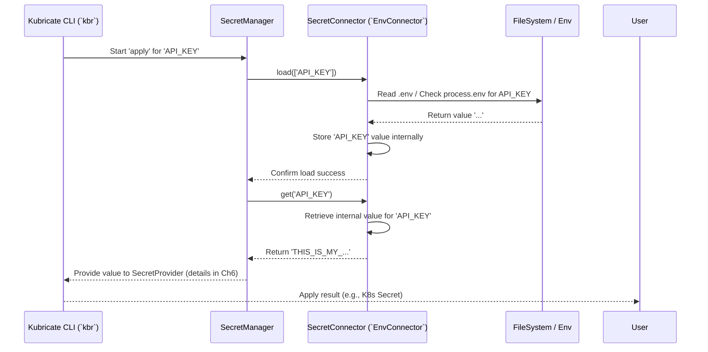

# Chapter 5: SecretConnector

In the [previous chapter](04_secretmanager_.md), we met the [SecretManager](04_secretmanager_.md), our project's central coordinator for handling sensitive information. We learned that the `SecretManager` knows *what* secrets our application needs (like an `API_KEY`), but it doesn't fetch the secret values itself.

So, how does the `SecretManager` actually get the secret values from places like environment variables, `.env` files, or cloud secret stores? That's the job of the **SecretConnector**!

## The Problem: Getting Secrets from Different Places

Imagine secrets are like valuable items stored in different kinds of safes:

*   Some are in a simple lockbox at home (like a `.env` file on your computer).
*   Some are in a high-security bank vault (like Azure Key Vault or HashiCorp Vault).
*   Some might be written on a hidden note (like an environment variable).

The [SecretManager](04_secretmanager_.md) knows you need the "Gold Coin" secret, but it doesn't know *how* to open the specific safe where it's stored. You need the right **key** for the right **safe**.

In Kubricate, a **SecretConnector** is like that specific key. It's designed to unlock *one particular type* of secret storage system and retrieve the secret value.

## What is a SecretConnector?

A **SecretConnector** is an adapter specifically responsible for **reading** secret values from an external system. Its only job is to fetch the raw secret data.

*   **The Key:** Think of it as the specific key for a specific safe. You'll have different connectors for different systems:
    *   `EnvConnector`: Reads from `.env` files or environment variables (like a key for a simple lockbox).
    *   `AzureKeyVaultConnector`: Reads from Azure Key Vault (like a keycard for a bank vault).
    *   `VaultConnector`: Reads from HashiCorp Vault.
    *   *(Others for 1Password, AWS Secrets Manager, etc.)*
*   **Abstraction:** Connectors hide the complex details of *how* to talk to each specific system (like knowing the combination, using the right API calls, handling authentication).
*   **Standard Interface:** They provide a consistent way for the [SecretManager](04_secretmanager_.md) to interact with them, primarily through two methods: `load()` and `get()`. This means the `SecretManager` doesn't need to know the specifics of Azure or `.env` files; it just asks the appropriate connector using the standard methods.
*   **Read-Only:** Connectors only *read* secrets. They don't modify them or create Kubernetes resources. They just fetch the value.

The `SecretConnector` is the component that bridges the gap between your declared secret needs in the [SecretManager](04_secretmanager_.md) and the actual location where the secret values live.

## Using a SecretConnector: The `EnvConnector` Example

Let's continue our example from the previous chapter where we needed an `API_KEY`. We decided to store it in a `.env` file during development. How do we tell the [SecretManager](04_secretmanager_.md) to use the `EnvConnector` (the "key" for `.env` files) to get this value?

**Goal:** Fetch the `API_KEY` from a `.env` file using `EnvConnector`.

**1. The `.env` File**

First, make sure you have a `.env` file in your project root:

```dotenv
# File: .env
# This is the secret value EnvConnector will read
API_KEY=THIS_IS_MY_SUPER_SECRET_KEY_12345
```

**2. Install the Connector Package**

Kubricate provides connectors in separate packages. For `.env` files and environment variables, we need `@kubricate/env`:

```bash
npm install @kubricate/env
```

**3. Register the Connector with `SecretManager`**

Now, we need to give our "key" (`EnvConnector`) to our "secretary" ([SecretManager](04_secretmanager_.md)). We do this using the `.addConnector()` method when setting up our `SecretManager` instance.

```typescript
// File: src/my-secrets.ts
import { SecretManager } from '@kubricate/core';
import { EnvConnector } from '@kubricate/env'; // Import the connector class
import { OpaqueSecretProvider } from '@kubricate/kubernetes/providers'; // (For context, from Ch4)

// Create the SecretManager instance
export const mySecretManager = new SecretManager()
  // Give the SecretManager the 'EnvConnector' key, naming it 'DotEnv'
  .addConnector('DotEnv', new EnvConnector({
    // Optional: Configure the connector, e.g., allow reading .env
    allowDotEnv: true, // Default is true
    // prefix: 'MYAPP_SECRET_' // Optional: Look for env vars like MYAPP_SECRET_API_KEY
  }))
  // Register a provider (how to deliver the secret, covered in Ch6)
  .addProvider('K8sSecret', new OpaqueSecretProvider({ name: 'my-app-secrets' }));
```

*   We import `EnvConnector` from `@kubricate/env`.
*   We call `.addConnector('DotEnv', new EnvConnector())`. This does two things:
    *   Creates an instance of the `EnvConnector`. We can pass configuration options here (like `allowDotEnv`).
    *   Registers this instance with the `SecretManager` under the logical name `'DotEnv'`. This is how the `SecretManager` refers to this specific connector.

**4. Declare the Secret (Implicitly Using the Connector)**

When we declare our secret using `.addSecret()`, the [SecretManager](04_secretmanager_.md) needs to know which connector to use to fetch it.

```typescript
// File: src/my-secrets.ts (continued)

export const mySecretManager = new SecretManager()
  .addConnector('DotEnv', new EnvConnector())
  .addProvider('K8sSecret', new OpaqueSecretProvider({ name: 'my-app-secrets' }))
  // Declare the secret we need
  .addSecret({ name: 'API_KEY' });
```

*   If `'DotEnv'` is the *only* connector registered, or if we explicitly set it as the default using `.setDefaultConnector('DotEnv')`, the `SecretManager` will automatically associate `API_KEY` with the `DotEnv` connector.
*   Alternatively, you can be explicit: `.addSecret({ name: 'API_KEY', connector: 'DotEnv' })`.

**5. How It Works During CLI Commands**

Now, when you run commands like `kbr secret validate` or `kbr secret apply`:

1.  The [Kubricate CLI (`kbr`)](01_kubricate_cli___kbr_____kubricate___.md) invokes the [SecretManager](04_secretmanager_.md).
2.  The `SecretManager` sees that it needs the `API_KEY`.
3.  It determines that the connector responsible for `API_KEY` is the one named `'DotEnv'` (our `EnvConnector` instance).
4.  The `SecretManager` calls methods like `load(['API_KEY'])` and then `get('API_KEY')` on the `EnvConnector` instance.
5.  The `EnvConnector` instance reads the `.env` file (because `allowDotEnv` was true) and/or checks environment variables, finds the value for `API_KEY`.
6.  The `EnvConnector` returns the value `"THIS_IS_MY_SUPER_SECRET_KEY_12345"` back to the `SecretManager`.
7.  The `SecretManager` then proceeds with validation or passes the value to the appropriate [SecretProvider](06_secretprovider_.md) (which we'll cover next).

The `SecretConnector` acted as the specialized tool (the key) to retrieve the value from its specific source (the `.env` file safe).

## How SecretConnectors Work Under the Hood

All connectors follow a standard contract defined by the `BaseConnector` interface in `@kubricate/core`. This ensures the [SecretManager](04_secretmanager_.md) can work with any connector in the same way. The two main methods are:

1.  **`load(names: string[]): Promise<void>`**
    *   **Purpose:** To efficiently fetch *multiple* secret values from the external system at once and cache them internally within the connector instance. It should also validate if the requested secrets actually exist in the source.
    *   **Analogy:** Imagine going to a bank with a list of safe deposit boxes you need to access. The `load` step is like gathering all the necessary keys and checking with the bank teller that all your boxes exist *before* you go into the vault room. This is often more efficient than accessing each box individually.
    *   **When is it called?** Typically called by the `SecretManager` at the beginning of operations like `validate` or `apply` for all secrets associated with that connector.

2.  **`get(name: string): SecretValue`**
    *   **Purpose:** To retrieve the value of a *single* secret (identified by `name`) from the connector's internal cache. This method should only be called *after* `load()` has been successfully called for that secret name.
    *   **Analogy:** Once you're in the vault room (after the `load` step), `get` is like using one specific key (that you already gathered and validated) to open one specific safe deposit box and retrieve its contents.
    *   **When is it called?** Called by the `SecretManager` whenever it needs the actual value of a specific secret *after* ensuring it has been loaded.

**Sequence Diagram (`kbr secret apply` for `API_KEY` using `EnvConnector`)**

This diagram shows how the `SecretManager` uses the `EnvConnector`'s `load` and `get` methods:



**Code Dive**

Let's peek at the core interface and a simplified `EnvConnector`.

1.  **`BaseConnector` Interface:** Defines the contract.

    ```typescript
    // File: packages/core/src/secret/connectors/BaseConnector.ts (Simplified)

    import type { SecretValue } from '../types.js';

    // The blueprint for all connectors
    export interface BaseConnector<Config extends object = object> {
      config: Config; // Holds connector-specific configuration

      // Load and validate specified secrets from the source
      load(names: string[]): Promise<void>;

      // Get a previously loaded secret's value
      get(name: string): SecretValue;

      // Optional methods for logging, setting working directory etc.
      // setWorkingDir?(path: string): void;
      // logger?: BaseLogger;
    }
    ```
    This interface ensures any connector, whether for `.env`, Azure, or Vault, will have the essential `load` and `get` methods.

2.  **`EnvConnector` Implementation:** Shows how `load` and `get` might work for `.env`/environment variables.

    ```typescript
    // File: packages/env/src/EnvConnector.ts (Simplified)
    import { type BaseConnector, type SecretValue } from '@kubricate/core';
    import { config as loadDotenv } from 'dotenv'; // Library to read .env
    import path from 'node:path';

    export class EnvConnector implements BaseConnector<{ allowDotEnv?: boolean, prefix?: string }> {
      private secrets = new Map<string, SecretValue>(); // Internal cache
      private prefix: string;

      constructor(public config: { allowDotEnv?: boolean, prefix?: string } = {}) {
        this.prefix = config.prefix ?? ''; // Optional prefix for env vars
      }

      async load(names: string[]): Promise<void> {
        // 1. Load .env file if allowed
        if (this.config.allowDotEnv ?? true) {
          loadDotenv({ path: path.join(process.cwd(), '.env') });
          // this.logger?.debug('Loaded .env file');
        }

        // 2. Check environment variables for each requested name
        for (const name of names) {
          const envVarName = this.prefix + name; // e.g., API_KEY or MYAPP_API_KEY
          const value = process.env[envVarName];

          if (value === undefined) {
            throw new Error(`Missing environment variable: ${envVarName}`);
          }
          this.secrets.set(name, value); // Store found value in cache
          // this.logger?.debug(`Loaded secret: ${name}`);
        }
      }

      get(name: string): SecretValue {
        if (!this.secrets.has(name)) {
          // Should not happen if load() was called correctly
          throw new Error(`Secret '${name}' not loaded. Call load() first.`);
        }
        return this.secrets.get(name)!; // Retrieve from cache
      }
    }
    ```
    The `load` method checks `process.env` (and potentially loads `.env` first), storing found values in the `secrets` map. The `get` method simply retrieves a value from that map.

## Conclusion

You've now learned about **SecretConnectors**, the specialized adapters in Kubricate responsible for fetching secret values from external systems.

Key takeaways:

*   They act like specific **keys** for different types of secret **safes** (e.g., `EnvConnector` for `.env`/env vars, `AzureKeyVaultConnector` for Azure).
*   Their sole focus is **reading** raw secret data.
*   They hide the complexity of interacting with different secret systems.
*   They provide a standard **`load()`** and **`get()`** interface for the [SecretManager](04_secretmanager_.md).
*   You register connector instances with the `SecretManager` using `.addConnector()`.

We now understand how the [SecretManager](04_secretmanager_.md) uses `SecretConnectors` to *get* the secret values. But what happens next? How are these values actually *used* or *delivered* to make them available to our applications in Kubernetes? That's the job of the **SecretProvider**, which we'll explore in the next chapter.

**Next:** [Chapter 6: SecretProvider](06_secretprovider_.md)

---

Generated by [AI Codebase Knowledge Builder](https://github.com/The-Pocket/Tutorial-Codebase-Knowledge)