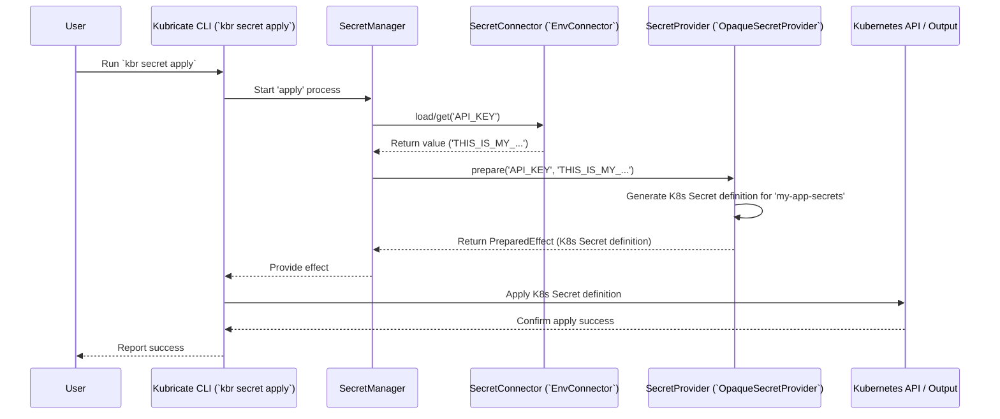

# Chapter 6: SecretProvider

Welcome to Chapter 6! In the [previous chapter](05_secretconnector_.md), we learned how [SecretConnectors](05_secretconnector_.md) act like keys, fetching the raw values of our secrets from different sources like `.env` files or cloud vaults.

We successfully got our `API_KEY` value! But... now what? Just having the secret value isn't enough. Our application running inside Kubernetes needs to *access* this value. How do we get the fetched secret value *into* a form that Kubernetes and our application can understand and use?

That's where the **SecretProvider** comes in!

## The Problem: Delivering the Secret Value

Think back to our analogy from the last chapter. The [SecretConnector](05_secretconnector_.md) was the key that opened the safe (e.g., the `.env` file) and retrieved the valuable item (the `API_KEY` value: `THIS_IS_MY_SUPER_SECRET_KEY_12345`).

Now, we have this valuable item. How do we deliver it to its final destination (our application in Kubernetes)?

*   Do we put it in a standard, secure box (like a Kubernetes `Secret` object)?
*   Do we hand it directly to the application as a specific instruction (like an environment variable)?
*   Do we leave a note for another delivery service (like annotations for an external secrets operator)?

We need a way to define *how* the fetched secret value should be packaged and delivered within the Kubernetes environment.

## What is a SecretProvider?

A **SecretProvider** is an adapter that defines **how** a secret value, once fetched by a [SecretConnector](05_secretconnector_.md), should be represented or injected into Kubernetes resources. It's the "delivery service" that decides the final form of the secret.

*   **The Delivery Method:** If the Connector is the key, the Provider is the specific delivery mechanism. Different providers handle delivery in different ways:
    *   `OpaqueSecretProvider`: Creates a standard Kubernetes `Secret` object (like packaging the item in a standard secure box).
    *   *(Hypothetical)* `EnvVarProvider`: Might directly inject the secret value as an environment variable into a Deployment's definition (like handing the value directly as an instruction).
    *   *(Hypothetical)* `ExternalSecretAnnotationProvider`: Might manage annotations on a resource so that an external tool like External Secrets Operator knows how to fetch and inject the secret (like leaving instructions for another specialized delivery service).
*   **Translation:** The Provider translates the abstract need for a secret ("I need `API_KEY`") and its raw value into concrete Kubernetes configurations (like a specific YAML structure for a `Secret` object) or actions needed during deployment.
*   **Works with `SecretManager`:** You register Provider instances with the [SecretManager](04_secretmanager_.md), just like you did with Connectors. The `SecretManager` then uses the appropriate Provider for each declared secret.

The `SecretProvider` bridges the gap between the raw secret value obtained by the [SecretConnector](05_secretconnector_.md) and how that secret is ultimately made available within your Kubernetes cluster.

## Using a SecretProvider: The `OpaqueSecretProvider` Example

Let's continue our `API_KEY` example. We fetched the value using `EnvConnector`. Now, we want to deliver it by creating a standard Kubernetes `Secret` object named `my-app-secrets` in the `default` namespace.

**Goal:** Use `OpaqueSecretProvider` to turn the fetched `API_KEY` value into a Kubernetes `Secret` resource.

**1. Install the Provider Package**

Providers related to Kubernetes resources are typically found in the `@kubricate/kubernetes` package.

```bash
npm install @kubricate/kubernetes
# Also ensure you have the core package
npm install @kubricate/core
```

**2. Register the Provider with `SecretManager`**

We need to tell our [SecretManager](04_secretmanager_.md) about this delivery method. We'll update our `src/my-secrets.ts` file.

```typescript
// File: src/my-secrets.ts
import { SecretManager } from '@kubricate/core';
import { EnvConnector } from '@kubricate/env'; // Our connector from Ch5
// Import the provider for creating standard K8s Secrets
import { OpaqueSecretProvider } from '@kubricate/kubernetes/providers';

// Create the SecretManager instance
export const mySecretManager = new SecretManager()
  // Register our connector (key) from Chapter 5
  .addConnector('DotEnv', new EnvConnector())
  // Register our provider (delivery service)
  .addProvider('K8sSecret', new OpaqueSecretProvider({
    // Configuration for this provider instance:
    name: 'my-app-secrets', // The name of the K8s Secret object to create
    namespace: 'default', // Optional: The namespace (defaults to 'default')
  }));
```

*   We import `OpaqueSecretProvider` from `@kubricate/kubernetes/providers`.
*   We call `.addProvider('K8sSecret', new OpaqueSecretProvider(...))`. This does two things:
    *   Creates an instance of the `OpaqueSecretProvider`. We configure it with the desired Kubernetes `Secret` name (`my-app-secrets`).
    *   Registers this instance with the `SecretManager` under the logical name `'K8sSecret'`.

**3. Declare the Secret (Linking to the Provider)**

Now, when we declare our secret, the [SecretManager](04_secretmanager_.md) needs to know which provider (delivery method) to use for it.

```typescript
// File: src/my-secrets.ts (continued)

export const mySecretManager = new SecretManager()
  .addConnector('DotEnv', new EnvConnector())
  .addProvider('K8sSecret', new OpaqueSecretProvider({ name: 'my-app-secrets' }))
  // Declare the secret we need
  .addSecret({
    name: 'API_KEY',
    // Optional: Explicitly specify the provider.
    // If omitted and 'K8sSecret' is the only provider (or set as default),
    // the SecretManager will use it automatically.
    // provider: 'K8sSecret'
  });
```

*   We use `.addSecret({ name: 'API_KEY' })`.
*   The `SecretManager` associates `API_KEY` with the provider named `'K8sSecret'` (our `OpaqueSecretProvider` instance). This happens automatically if it's the only provider registered, or if we set it as the default using `.setDefaultProvider('K8sSecret')`. You can also explicitly link them using the `provider` property in `addSecret`.

**4. How It Works During `kbr secret apply`**

Remember the `kbr secret apply` command from [Chapter 1](01_kubricate_cli___kbr_____kubricate___.md)? Let's trace how the Provider fits in:

1.  You run `npx kbr secret apply`.
2.  The [Kubricate CLI (`kbr`)](01_kubricate_cli___kbr_____kubricate___.md) finds your `kubricate.config.ts` and the registered `mySecretManager`.
3.  The [SecretManager](04_secretmanager_.md) sees the declared secret `API_KEY`.
4.  It uses the associated [SecretConnector](05_secretconnector_.md) (`'DotEnv'`) to fetch the value (`"THIS_IS_MY_SUPER_SECRET_KEY_12345"`) from the `.env` file.
5.  **Crucially:** The `SecretManager` now passes the secret name (`API_KEY`) and the fetched value (`"THIS_IS_MY_..."`) to the associated **SecretProvider** (`'K8sSecret'`, our `OpaqueSecretProvider` instance).
6.  The `OpaqueSecretProvider` instance receives `API_KEY` and its value. Based on its configuration (`name: 'my-app-secrets'`), it **prepares** the definition of a standard Kubernetes `Secret` object. This definition will look something like:

    ```yaml
    # Generated internally by OpaqueSecretProvider.prepare()
    apiVersion: v1
    kind: Secret
    metadata:
      name: my-app-secrets # From provider config
      namespace: default  # From provider config
    type: Opaque
    data:
      # Key is the secret name, value is base64 encoded
      API_KEY: VEhJU19JU19NWV9TVVBFUl9TRUNSRVRfS0VZXzEyMzQ1
    ```

7.  The `SecretManager` collects this definition (called an "effect").
8.  The Kubricate CLI takes this effect and applies it to your Kubernetes cluster (e.g., using `kubectl apply`).

**Outcome:** After running `kbr secret apply`, a Kubernetes `Secret` named `my-app-secrets` exists in the `default` namespace, containing the `API_KEY` ready for your application [Stack](03_stack_.md) to consume (e.g., by mounting it as an environment variable or volume). We successfully delivered the secret!

## How SecretProviders Work Under the Hood

Providers implement a standard interface (`BaseProvider` from `@kubricate/core`) so the [SecretManager](04_secretmanager_.md) can interact with them consistently. Key parts of this interface are:

*   **`prepare(name: string, value: SecretValue): PreparedEffect[]`**
    *   **Purpose:** Called during `kbr secret apply`. This is the core method for "delivery". It takes the secret's declared name (e.g., `API_KEY`) and its fetched value (e.g., `"THIS_IS_MY_..."`) and translates them into one or more `PreparedEffect` objects. An effect describes an action to take, like creating a specific Kubernetes resource. For `OpaqueSecretProvider`, this method generates the YAML definition for the `Secret` object.
    *   **Analogy:** This is the delivery service packaging the item (secret value) into the correct box (Kubernetes `Secret` manifest) according to the instructions.

*   **`getInjectionPayload(injections: ProviderInjection[]): unknown`**
    *   **Purpose:** Called during `kbr generate` when a [Stack](03_stack_.md) uses secrets (via `.useSecrets(...)`). It defines *how* a resource within the Stack (like a Deployment) should refer to the secret that the Provider manages. For `OpaqueSecretProvider`, this might generate the `env` array structure needed to inject the secret key (`API_KEY`) from the Kubernetes `Secret` (`my-app-secrets`) as an environment variable. We'll see more about `.useSecrets` in the [SecretsOrchestrator](07_secretsorchestrator_.md) chapter.
    *   **Analogy:** This provides the instructions on the *receiving end* (the application's Deployment) explaining how to *use* the delivered package (e.g., "look inside the box named 'my-app-secrets' for the item labeled 'API_KEY' and use it as the `API_KEY` environment variable").

*   **`getTargetPath(strategy: SecretInjectionStrategy): string`**
    *   **Purpose:** Helps determine *where* inside a Kubernetes manifest the `getInjectionPayload` result should be placed. For example, for environment variables, it might return `spec.template.spec.containers[0].env`.
    *   **Analogy:** Specifies the exact location on the doorstep (the Deployment YAML) where the delivery instructions (`env` array) should be placed.

*   **`supportedStrategies`: `SecretInjectionStrategy['kind'][]`**
    *   **Purpose:** Lists the ways this Provider knows how to inject secrets (e.g., `'env'`, `'imagePullSecret'`, `'annotation'`).
    *   **Analogy:** Lists the types of delivery instructions the Provider knows how to handle (e.g., "deliver as environment variable", "deliver as image pull secret").

*   **`targetKind`: `string`**
    *   **Purpose:** The default kind of Kubernetes resource this provider typically injects into (e.g., `'Deployment'`, `'StatefulSet'`). Used to help resolve injection targets automatically.
    *   **Analogy:** The typical type of building the delivery service delivers to (e.g., usually delivers to 'Deployments').

**Sequence Diagram (`kbr secret apply` showing Provider interaction)**



**Code Dive**

Let's look at the essential parts.

1.  **`BaseProvider` Interface:** Defines the contract for all providers.

    ```typescript
    // File: packages/core/src/secret/providers/BaseProvider.ts (Simplified)
    import type { SecretInjectionStrategy, SecretValue, PreparedEffect, ProviderInjection } from '@kubricate/core';

    export interface BaseProvider<...> {
      name: string | undefined; // Name given during registration
      config: Config; // Configuration passed during instantiation

      // Called by 'kbr secret apply'
      prepare(name: string, value: SecretValue): PreparedEffect[];

      // Called by Stack's .useSecrets() during 'kbr generate'
      getInjectionPayload(injectes: ProviderInjection[]): unknown;

      // Get K8s manifest path for injection
      getTargetPath(strategy: SecretInjectionStrategy): string;

      // Default K8s resource kind for injection
      readonly targetKind: string;

      // List of injection methods supported
      readonly supportedStrategies: SupportedStrategies[];

      // Optional: methods for merging multiple secrets into one resource (like K8s Secret)
      // mergeSecrets?(effects: PreparedEffect[]): PreparedEffect[];
      // getEffectIdentifier?(effect: PreparedEffect): string;
      // readonly allowMerge?: boolean;
    }
    ```

2.  **`OpaqueSecretProvider` Implementation:** Shows how `prepare` and `getInjectionPayload` might work.

    ```typescript
    // File: packages/kubernetes/src/OpaqueSecretProvider.ts (Simplified)
    import type { BaseProvider, PreparedEffect, ProviderInjection, SecretInjectionStrategy, SecretValue } from '@kubricate/core';
    import { Base64 } from 'js-base64'; // For encoding secret data

    export class OpaqueSecretProvider implements BaseProvider<...> {
      name: string | undefined; // e.g., 'K8sSecret'
      config: OpaqueSecretProviderConfig; // e.g., { name: 'my-app-secrets', namespace: 'default' }

      readonly targetKind = 'Deployment';
      readonly supportedStrategies = ['env']; // Only knows how to prepare for env var injection

      constructor(config: OpaqueSecretProviderConfig) {
        this.config = config;
      }

      // Called by 'kbr secret apply'
      prepare(secretName: string, value: SecretValue): PreparedEffect[] {
        // Encode the value as Base64, required by Kubernetes Secrets
        const encodedValue = Base64.encode(String(value));

        // Return an effect describing the Kubernetes Secret object to create
        return [{
          type: 'kubectl', // Indicates this effect results in a K8s resource
          providerName: this.name,
          secretName: secretName,
          value: { // The actual K8s Secret definition
            apiVersion: 'v1',
            kind: 'Secret',
            metadata: {
              name: this.config.name, // Use configured name 'my-app-secrets'
              namespace: this.config.namespace ?? 'default',
            },
            type: 'Opaque',
            data: {
              // The key in the 'data' field is the original secret name
              [secretName]: encodedValue,
            },
          },
        }];
      }

      // Called by Stack's .useSecrets() during 'kbr generate'
      getInjectionPayload(injects: ProviderInjection[]): unknown {
        // Generates the 'env' array snippet for a Deployment/Pod spec
        return injects.map((inject) => ({
          name: inject.meta?.targetName ?? inject.meta?.secretName, // Env var name (e.g., API_KEY)
          valueFrom: {
            secretKeyRef: {
              name: this.config.name, // K8s Secret name ('my-app-secrets')
              key: inject.meta?.secretName, // Key within the Secret ('API_KEY')
            },
          },
        }));
      }

      getTargetPath(strategy: SecretInjectionStrategy): string {
        if (strategy.kind === 'env') {
          // Default path for env vars in the first container
          return `spec.template.spec.containers[0].env`;
        }
        throw new Error(`Unsupported strategy: ${strategy.kind}`);
      }

      // ... other methods like mergeSecrets, getEffectIdentifier ...
    }
    ```
    The `prepare` method creates the definition of the `Secret` object, while `getInjectionPayload` creates the snippet needed in a Deployment to *use* that `Secret`.

## Conclusion

You've now learned about **SecretProviders**, the crucial components in Kubricate that determine *how* fetched secret values are delivered and represented in Kubernetes.

Key takeaways:

*   Providers act as the **delivery mechanism** for secrets (e.g., create K8s `Secret`, manage annotations).
*   They **translate** raw secret values into concrete Kubernetes configurations or actions.
*   `OpaqueSecretProvider` is a common provider that creates standard Kubernetes `Secret` objects.
*   Providers implement the `BaseProvider` interface, with key methods like `prepare` (for `kbr secret apply`) and `getInjectionPayload` (for `kbr generate` via Stacks).
*   You register Provider instances with the [SecretManager](04_secretmanager_.md) using `.addProvider()`.

We now have a complete picture of the basic secret flow:
1.  **Declare:** Tell the [SecretManager](04_secretmanager_.md) what you need (`addSecret`).
2.  **Fetch:** The [SecretConnector](05_secretconnector_.md) gets the value (`load`/`get`).
3.  **Deliver:** The **SecretProvider** determines the final form (`prepare`/`getInjectionPayload`).

But how does Kubricate manage the overall process, especially when multiple secrets, connectors, and providers are involved? How does the CLI coordinate these steps? That's the role of the **SecretsOrchestrator**, which we'll explore in the next chapter.

**Next:** [Chapter 7: SecretsOrchestrator](07_secretsorchestrator_.md)

---

Generated by [AI Codebase Knowledge Builder](https://github.com/The-Pocket/Tutorial-Codebase-Knowledge)