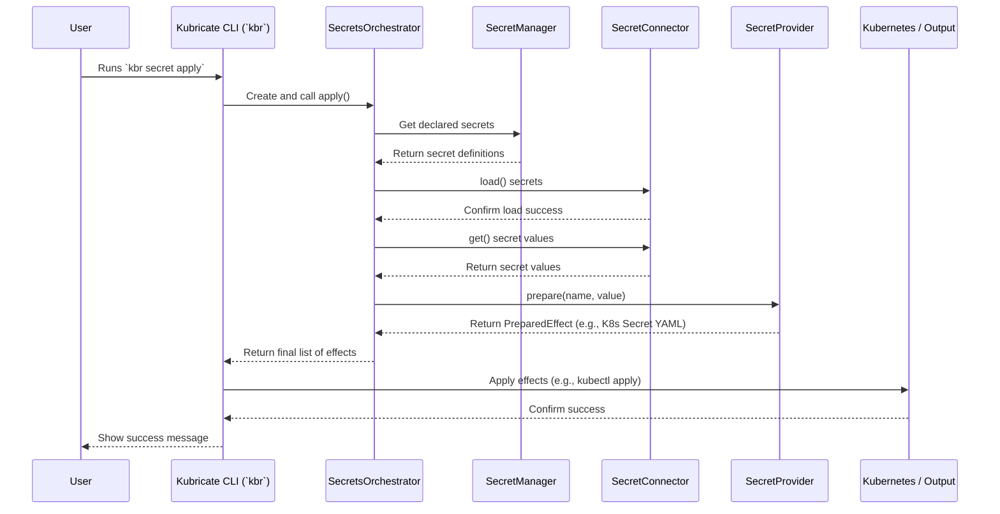

# Chapter 7: SecretsOrchestrator

In the [previous chapter](06_secretprovider_.md), we explored [SecretProviders](06_secretprovider_.md), the components responsible for taking a secret value and preparing it for Kubernetes (like creating a `Secret` object). We now understand how secrets are fetched ([SecretConnectors](05_secretconnector_.md)) and how they are delivered ([SecretProviders](06_secretprovider_.md)).

But who manages this whole process? When you run `kbr secret validate` or `kbr secret apply`, what coordinates the actions of the [SecretManager](04_secretmanager_.md), the Connectors, and the Providers?

Meet the **SecretsOrchestrator**.

## The Stage Manager for Secrets

Imagine a theatre play. You have:

*   **Actors:** The [SecretConnectors](05_secretconnector_.md) (fetching lines/props) and [SecretProviders](06_secretprovider_.md) (delivering props to the stage).
*   **Script/Inventory:** The [SecretManager](04_secretmanager_.md) (knowing which actors need which props).
*   **Director/Commands:** You, using the [Kubricate CLI (`kbr`)](01_kubricate_cli___kbr_____kubricate___.md) (like `kbr secret apply` - "Start the scene!").

But there's a crucial role missing: the **Stage Manager**. This person doesn't act or write the script, but they follow the director's cues, ensure actors get their props at the right time, check that everything is in place before the curtain rises, and manage the flow of the entire performance.

In Kubricate, the **SecretsOrchestrator** is that Stage Manager for your secrets. It's the engine that drives the secret management lifecycle, primarily used internally by the CLI commands. You don't typically interact with it directly in your configuration, but it's working behind the scenes whenever you manage secrets.

## What Does the SecretsOrchestrator Do?

The `SecretsOrchestrator` is responsible for the end-to-end process when you run commands like `kbr secret validate` or `kbr secret apply`. Its main tasks include:

1.  **Collecting Definitions:** It asks your configured [SecretManager](04_secretmanager_.md) for the list of all declared secrets.
2.  **Coordinating Connectors:** For each secret, it identifies the correct [SecretConnector](05_secretconnector_.md) and tells it to `load()` the required values.
3.  **Validating:** During `kbr secret validate`, it ensures that all Connectors can successfully `load()` their respective secrets. If a Connector reports an error (e.g., secret not found in `.env` or Azure Key Vault), the Orchestrator catches this and tells the CLI to report the validation failure.
4.  **Coordinating Providers:** During `kbr secret apply`, after Connectors have loaded values, the Orchestrator retrieves the values using the Connector's `get()` method. It then passes the secret name and value to the appropriate [SecretProvider](06_secretprovider_.md) and tells it to `prepare()` the final "effect" (like the YAML definition for a Kubernetes `Secret`).
5.  **Handling Conflicts (Basic):** What if two different parts of your configuration (e.g., two stacks, though less common with the current single-manager setup) try to define the same secret key within the same Kubernetes `Secret` object? The Orchestrator oversees the process of applying conflict resolution rules (based on your `kubricate.config.ts`) to decide how to handle such situations (e.g., merge, error, overwrite). *Note: Advanced conflict resolution is a more complex topic, but the Orchestrator is where it happens.*
6.  **Returning Effects:** Finally, it gathers all the prepared effects from the Providers and gives them back to the CLI command (`kbr secret apply`) to be executed (e.g., applying the generated Kubernetes `Secret` YAML to your cluster).

You don't *write* code to use the `SecretsOrchestrator` directly. You configure your [SecretManager](04_secretmanager_.md), [SecretConnectors](05_secretconnector_.md), and [SecretProviders](06_secretprovider_.md), and then you use the [Kubricate CLI (`kbr`)](01_kubricate_cli___kbr_____kubricate___.md). The CLI automatically uses the `SecretsOrchestrator` internally to perform the requested action.

## How It Works Under the Hood

Let's trace the journey when you run `npx kbr secret apply`:

1.  **You run `kbr secret apply`**.
2.  The [CLI](01_kubricate_cli___kbr_____kubricate___.md) loads your `kubricate.config.ts`.
3.  The CLI identifies the configured [SecretManager](04_secretmanager_.md) instance.
4.  The CLI creates an instance of the `SecretsOrchestrator`, giving it the configuration and the logger.
5.  The CLI calls the `apply()` method on the `SecretsOrchestrator` instance.
6.  **Inside `SecretsOrchestrator.apply()`:**
    *   It first calls its own `validate()` method to ensure everything is configured correctly and connectors are ready.
    *   It asks the [SecretManager](04_secretmanager_.md) for the list of all declared secrets.
    *   It groups secrets by the [SecretConnector](05_secretconnector_.md) responsible for fetching them.
    *   It calls `load()` on each necessary `SecretConnector` instance.
    *   It calls `get()` on the `SecretConnector` instances to retrieve the actual values.
    *   It groups secrets/values by the [SecretProvider](06_secretprovider_.md) responsible for delivering them.
    *   It calls `prepare()` on each necessary `SecretProvider` instance, passing the secret name and value. This generates the "effects" (like K8s Secret manifests).
    *   (If applicable) It applies conflict resolution and merging logic if multiple secrets need to be combined into a single effect (e.g., multiple keys in one K8s `Secret` object managed by the same `OpaqueSecretProvider`).
    *   It returns the final list of `PreparedEffect` objects to the CLI.
7.  The CLI takes the returned effects. For effects of type `kubectl`, it uses the Kubernetes API (or shells out to `kubectl`) to apply the generated resource definition to your cluster.
8.  The CLI reports success or failure back to you.

**Sequence Diagram (`kbr secret apply`)**

Here's a simplified view showing the `SecretsOrchestrator` coordinating the flow:



**Code Dive**

Let's look at some simplified snippets showing the Orchestrator's role.

1.  **Creating and Using the Orchestrator (Inside CLI Command Logic):**
    The code that handles the `kbr secret apply` command would look something like this:

    ```typescript
    // Simplified from: packages/kubricate/src/commands/SecretCommand.ts
    import { SecretsOrchestrator } from '@kubricate/core';
    // ... other imports like KubectlExecutor, logger

    // Assume 'config' is loaded from kubricate.config.ts
    // Assume 'logger' and 'kubectl' are initialized

    // 1. Create the orchestrator instance
    const orchestrator = SecretsOrchestrator.create({
      config: config,
      logger: logger,
      // Optional: effect options like working directory
      effectOptions: { workingDir: process.cwd() },
    });

    // 2. Call the orchestrator's main method
    // This triggers the validation, loading, preparing, merging process
    const effects = await orchestrator.apply(); // Or orchestrator.validate() for 'kbr secret validate'

    // 3. Process the results (for 'apply')
    if (effects.length > 0) {
      for (const effect of effects) {
        if (effect.type === 'kubectl') {
          logger.info(`Applying secret: ${effect.value?.metadata?.name}`);
          // await kubectl.apply(effect.value); // Actually apply to cluster
        }
      }
      logger.log('Secrets applied successfully.');
    } else {
      logger.warn('No secrets to apply.');
    }
    ```
    This shows how the CLI command uses the `SecretsOrchestrator.create()` factory and then calls `.apply()` to get the final results.

2.  **SecretsOrchestrator `apply` Method (Internal):**
    This is the core logic inside the Orchestrator itself.

    ```typescript
    // Simplified from: packages/core/src/secret/orchestrator/SecretsOrchestrator.ts
    import { SecretManagerEngine } from './SecretManagerEngine.js';
    // ... other imports

    export class SecretsOrchestrator {
      private engine: SecretManagerEngine; // Helper for manager/connector interactions
      // ... logger, providerCache

      constructor(engine: SecretManagerEngine, logger: BaseLogger) {
        this.engine = engine;
        // ...
      }

      static create(options: SecretsOrchestratorOptions): SecretsOrchestrator {
        const engine = new SecretManagerEngine(options); // Create the helper engine
        return new SecretsOrchestrator(engine, options.logger);
      }

      async apply(): Promise<PreparedEffect[]> {
        // Step 1: Validate config and managers (uses engine.validate internally)
        const managers = await this.validate();

        // Step 2: Load secrets from all managers (uses engine.loadSecrets)
        const resolvedSecrets = await this.loadSecretsFromManagers(managers);

        // Step 3: Prepare raw effects using providers
        const rawEffects = this.prepareEffects(resolvedSecrets);

        // Step 4: Merge effects based on conflict rules (complex logic simplified here)
        const mergedEffects = this.mergePreparedEffects(rawEffects);

        return mergedEffects; // Return the final list
      }

      // Helper to prepare effects for all resolved secrets
      private prepareEffects(resolvedSecrets: ResolvedSecret[]): PreparedEffectWithMeta[] {
        return resolvedSecrets.flatMap(secret => {
          // Find the correct provider instance
          const provider = this.resolveProviderByName(secret.providerName, secret.managerName);
          // Ask the provider to prepare its effect(s)
          const effects = provider.prepare(secret.key, secret.value);
          // Add metadata for merging/logging
          return effects.map(effect => ({ /* ... effect + metadata ... */ }));
        });
      }

      // ... other methods like validate(), loadSecretsFromManagers(), mergePreparedEffects(), etc.
    }
    ```
    This shows the high-level sequence within the `apply` method: validate, load, prepare, merge. It delegates some tasks like loading secrets to the internal `SecretManagerEngine`.

3.  **SecretManagerEngine (Internal Helper):**
    This internal class helps the Orchestrator interact with the `SecretManager` and `SecretConnectors`.

    ```typescript
    // Simplified from: packages/core/src/secret/orchestrator/SecretManagerEngine.ts

    export class SecretManagerEngine {
      // ... constructor with options

      // Collects the SecretManager instance(s) from the config
      collect(): MergedSecretManager { /* ... logic ... */ }

      // Validates connectors by trying to load secrets
      async validate(managers: MergedSecretManager): Promise<void> {
        for (const entry of Object.values(managers)) {
           // Ask SecretManager for its secrets
           const secrets = entry.secretManager.getSecrets();
           // Use internal loadSecrets to attempt loading via connectors
           await this.loadSecrets(entry.secretManager, secrets);
        }
      }

      // Loads secrets using the appropriate connectors
      async loadSecrets(
        secretManager: SecretManager,
        secrets: Record<string, SecretOptions>
      ): Promise<Record<string, SecretValue>> {
        const resolved: Record<string, SecretValue> = {};
        for (const name of Object.keys(secrets)) {
          // Find the right connector via SecretManager
          const connector = secretManager.resolveConnector(secrets[name].connector);
          // Call connector.load() and connector.get()
          await connector.load([name]);
          resolved[name] = connector.get(name);
        }
        return resolved;
      }

      // ... prepareEffects is similar, calling provider.prepare
    }
    ```
    The `SecretManagerEngine` encapsulates the logic for iterating through managers, finding the right connectors/providers via the `SecretManager`, and calling their respective methods (`load`, `get`, `prepare`).

## Conclusion

The **SecretsOrchestrator** is the invisible engine driving Kubricate's secret management. While you don't interact with it directly, it's essential for the functioning of CLI commands like `kbr secret validate` and `kbr secret apply`.

Key takeaways:

*   It acts as the **central coordinator** or "Stage Manager" for the entire secret lifecycle.
*   It's used **internally** by the [Kubricate CLI (`kbr`)](01_kubricate_cli___kbr_____kubricate___.md).
*   It orchestrates the interactions between the [SecretManager](04_secretmanager_.md), [SecretConnectors](05_secretconnector_.md), and [SecretProviders](06_secretprovider_.md).
*   It handles **validation**, **loading values**, **preparing effects**, and applying **conflict resolution**.
*   It ensures the secret management process is consistent and follows the rules defined in your configuration.

With the `SecretsOrchestrator` coordinating the process, Kubricate provides a robust way to manage secrets declaratively.

We've now covered the core components for managing Kubernetes resources ([Stacks](03_stack_.md)) and secrets ([SecretManager](04_secretmanager_.md), [Connectors](05_secretconnector_.md), [Providers](06_secretprovider_.md), and the Orchestrator). But how did we actually *define* the Kubernetes resources like Deployments and Services inside our Stacks? That's the job of the final core component we'll explore.

**Next:** [Chapter 8: ResourceComposer](08_resourcecomposer_.md)

---

Generated by [AI Codebase Knowledge Builder](https://github.com/The-Pocket/Tutorial-Codebase-Knowledge)