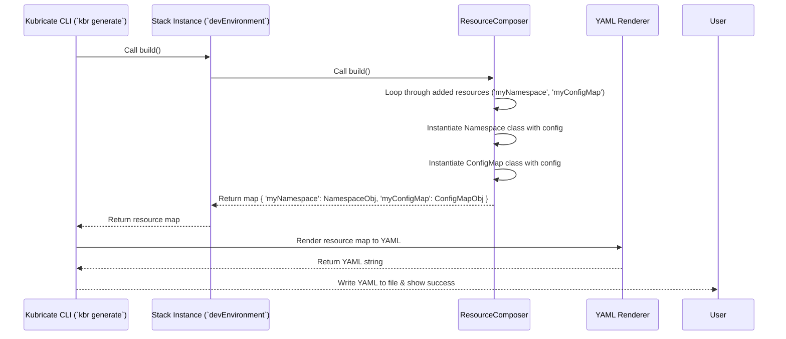

# Chapter 8: ResourceComposer

Welcome to the final chapter of our core Kubricate tutorial! In the [previous chapter](07_secretsorchestrator_.md), we saw how the [SecretsOrchestrator](07_secretsorchestrator_.md) acts as the stage manager, coordinating the complex dance of secret fetching and delivery when you run commands like `kbr secret apply`.

But let's zoom back out a bit. Remember our [Stacks](03_stack_.md) from Chapter 3? We defined reusable blueprints like `SimpleAppStack` that grouped Kubernetes resources (like a Deployment and a Service) together. When we ran `kbr generate`, these Stacks produced Kubernetes YAML.

How did the [Stack](03_stack_.md) actually know *which* specific resources (Deployment, Service, Namespace, etc.) to include and *how* to configure them? That's the job of the **ResourceComposer**.

## The Problem: Defining Resources Inside a Stack

Imagine you're building a Lego model using a blueprint ([Stack](03_stack_.md)). The blueprint tells you the overall structure ("Build a small house"). But you also need a way to list the specific Lego bricks needed ("One red 2x4 brick, two blue 1x2 bricks, one door frame...") and how they connect.

Similarly, when defining a [Stack](03_stack_.md) in Kubricate, you need a mechanism *inside* the Stack's definition to specify:

*   "I need a Kubernetes `Namespace` resource."
*   "Its `metadata.name` should be 'my-cool-app'."
*   "I also need a `Deployment` resource."
*   "It should use the image 'nginx:latest' and have 2 replicas."

How do we collect all these individual resource definitions within our Stack code in a structured way?

## ResourceComposer: Your Stack's Shopping Cart

Think of the **ResourceComposer** as the **shopping cart** you use while following your infrastructure blueprint ([Stack](03_stack_.md)). As you define your Stack, you use the `ResourceComposer` to add the "items" – the individual Kubernetes resources – you need.

*   **Adding Items:** You tell the `ResourceComposer`, "Add a `Deployment` to the cart." You also specify its details (like the image name, replica count, labels). You might add a `Service`, a `Namespace`, a `ConfigMap`, etc.
*   **Programmatic Definition:** Instead of writing raw YAML, you define these resources using TypeScript code, often leveraging typed models from libraries like `kubernetes-models` for better safety and autocompletion.
*   **Collection Point:** The `ResourceComposer` holds all these resource definitions together within the context of your [Stack](03_stack_.md).
*   **Ready for Checkout:** When you run `kbr generate`, Kubricate asks your [Stack](03_stack_.md) to "build" itself. The Stack then uses its filled `ResourceComposer` (the shopping cart) to provide the final list of resource definitions, which Kubricate then turns into the actual Kubernetes YAML manifest file (the checkout process).

The `ResourceComposer` provides methods like `addClass` and `addObject` to make adding these resource "items" easy and structured.

## Using the ResourceComposer: Defining a Namespace and ConfigMap

Let's revisit the idea of creating a [Stack](03_stack_.md) that defines a simple Namespace and a ConfigMap to hold some basic configuration data.

**Goal:** Use `ResourceComposer` inside a Stack definition to specify a Namespace and a ConfigMap.

**1. Install Dependencies**

We need `@kubricate/core` and `kubernetes-models` for the typed resources:

```bash
npm install @kubricate/core kubernetes-models
```

**2. Define the Stack Using `createStack` and `ResourceComposer`**

We'll use the `createStack` helper function (like we saw in [Chapter 3](03_stack_.md)). The key part is the function passed to `createStack`, which receives input data and returns a configured `ResourceComposer`.

```typescript
// File: src/stacks/ns-config-stack.ts
import { createStack, ResourceComposer } from '@kubricate/core';
import { Namespace } from 'kubernetes-models/v1';      // Typed Namespace model
import { ConfigMap } from 'kubernetes-models/v1';      // Typed ConfigMap model

// Define the input our Stack needs
interface NsConfigInput {
  namespaceName: string;
  configKey: string;
  configValue: string;
}

// Define the Stack using createStack
export const NsConfigStack = createStack(
  'NsConfigStack', // Give the Stack type a name
  // This function receives input and returns a ResourceComposer
  (input: NsConfigInput) =>
    // 1. Create a new "shopping cart"
    new ResourceComposer()
      // 2. Add a Namespace item
      .addClass({
        id: 'myNamespace', // A unique ID for this resource within the Stack
        type: Namespace,   // Use the typed Namespace class
        config: {          // Provide the configuration for the Namespace
          metadata: { name: input.namespaceName },
        },
      })
      // 3. Add a ConfigMap item
      .addClass({
        id: 'myConfigMap', // Another unique ID
        type: ConfigMap,   // Use the typed ConfigMap class
        config: {          // Provide the configuration for the ConfigMap
          metadata: {
            name: `${input.namespaceName}-app-config`, // Name based on input
            namespace: input.namespaceName,            // Place it in the created Namespace
          },
          data: {
            [input.configKey]: input.configValue, // Use dynamic key/value from input
          },
        },
      })
); // The ResourceComposer instance is returned here
```

Let's break down the function that uses the `ResourceComposer`:

1.  **`new ResourceComposer()`**: We start by creating an empty instance – our empty shopping cart.
2.  **`.addClass({ ... })` for Namespace**:
    *   We call the `addClass` method to add a resource defined by a class.
    *   `id: 'myNamespace'`: We give this resource a logical ID within the Stack. This is mainly for internal tracking and potential referencing.
    *   `type: Namespace`: We specify the class from `kubernetes-models` that represents the kind of resource we want (a Namespace).
    *   `config: { ... }`: We provide the configuration object that will be passed to the `Namespace` constructor. Here, we set the `metadata.name` using the input data.
3.  **`.addClass({ ... })` for ConfigMap**:
    *   We add another item, this time a `ConfigMap`.
    *   We give it a unique `id: 'myConfigMap'`.
    *   We specify the `type: ConfigMap`.
    *   We provide its `config`, setting its `metadata` (including name and namespace derived from input) and its `data` field using the dynamic key and value from the input.
4.  **Return Value**: The `createStack` helper expects this function to return the fully configured `ResourceComposer` instance.

**3. Instantiate and Configure the Stack**

Now, let's create an instance of this Stack and register it in `kubricate.config.ts`.

```typescript
// File: src/my-environment.ts
import { NsConfigStack } from './stacks/ns-config-stack';

// Create a specific instance of the stack for 'development'
export const devEnvironment = NsConfigStack.from({
  namespaceName: 'my-app-dev',
  configKey: 'API_ENDPOINT',
  configValue: 'https://dev.example.com/api',
});
```

```typescript
// File: kubricate.config.ts
import { defineConfig } from 'kubricate';
import { devEnvironment } from './src/my-environment';

export default defineConfig({
  stacks: {
    // Register our stack instance
    dev: devEnvironment,
  },
  // Secret config would go here if needed
});
```

**4. Generate YAML**

When you run `npx kbr generate`:

*   Kubricate finds the `dev` stack instance (`devEnvironment`).
*   It calls the stack's internal `build()` method.
*   The `build()` method retrieves the `ResourceComposer` we configured earlier (the one with the Namespace and ConfigMap definitions).
*   The `ResourceComposer` constructs the actual resource objects.
*   Kubricate renders these objects into YAML.

**Output (`.kubricate/stacks.yml` - Simplified):**

```yaml
# Generated by Kubricate - DO NOT EDIT MANUALLY
# Resource 'myNamespace' from Stack 'dev'
apiVersion: v1
kind: Namespace
metadata:
  name: my-app-dev # From input
  # ... other metadata added by Kubricate
---
# Resource 'myConfigMap' from Stack 'dev'
apiVersion: v1
kind: ConfigMap
metadata:
  name: my-app-dev-app-config # From input
  namespace: my-app-dev      # From input
  # ... other metadata
data:
  API_ENDPOINT: https://dev.example.com/api # From input
---
```

The `ResourceComposer` allowed us to define these two resources programmatically and dynamically based on the input to our [Stack](03_stack_.md)!

## How ResourceComposer Works Under the Hood

When `kbr generate` triggers a [Stack](03_stack_.md)'s `build()` method, how does the `ResourceComposer` turn those `.addClass()` calls into usable resource objects?

**High-Level Flow:**

1.  **`kbr generate` calls `Stack.build()`:** The generation process starts.
2.  **Stack Prepares:** The Stack might perform other actions, like preparing secret injections if `useSecrets()` was called. This sometimes involves calling `ResourceComposer.inject()` to add things like environment variables that reference Kubernetes Secrets.
3.  **Stack calls `ResourceComposer.build()`:** The Stack asks its internal `ResourceComposer` instance to finalize the list of resources.
4.  **Composer Iterates:** The `ResourceComposer` loops through all the definitions stored internally (in its `_entries` property) from the previous `.addClass()` or `.addObject()` calls.
5.  **Construct/Prepare Resources:** For each definition:
    *   If it was added via `addClass` (using a `type` like `Namespace` or `ConfigMap`), the composer instantiates the class, passing the stored `config` object to its constructor (e.g., `new Namespace({ metadata: { name: '...' } })`). It also applies any overrides specified via the Stack's `.override()` method.
    *   If it was added via `addObject` (as a plain object), the composer takes the stored `config` object and applies any overrides.
    *   *(Internal detail: It handles merging overrides and potential injections gracefully).*
6.  **Return Resource Map:** The composer returns a map where keys are the resource IDs (`'myNamespace'`, `'myConfigMap'`) and values are the fully constructed Kubernetes resource objects.
7.  **Stack Returns to CLI:** The Stack passes this map of resources up.
8.  **Render YAML:** The Kubricate CLI takes these objects and uses a YAML library to convert them into the final string written to your `.kubricate/stacks.yml` file.

**Sequence Diagram:**



**Code Dive**

Let's peek at the `ResourceComposer` class itself.

```typescript
// File: packages/core/src/ResourceComposer.ts (Simplified)
import { merge, cloneDeep, set, get, isPlainObject } from 'lodash-es';
import type { AnyClass } from './types.js';
import { validateId } from './utils.js';

// Internal structure to store how a resource was added
interface ResourceEntry {
  type?: AnyClass; // The class (e.g., Namespace, Deployment) if added via addClass
  config: Record<string, unknown>; // The configuration object
  entryType: 'class' | 'object' | 'instance'; // How it was added
}

export class ResourceComposer<Entries extends Record<string, unknown> = {}> {
  // Internal map storing resource definitions by their ID
  _entries: Record<string, ResourceEntry> = {};
  // Internal map storing overrides provided via Stack.override()
  _override: Record<string, unknown> = {};

  // Method to add a resource defined by a class (e.g., from kubernetes-models)
  addClass<const Id extends string, T extends AnyClass>(params: {
    id: Id;
    type: T;
    config: ConstructorParameters<T>[0]; // Ensures config matches class constructor
  }) {
    validateId(params.id, 'resourceId');
    this._entries[params.id] = {
      type: params.type,
      config: params.config,
      entryType: 'class', // Mark as added via class
    };
    return this; // Allow chaining .addClass().addClass()...
  }

  // Method to add a resource as a plain JavaScript object
  addObject<const Id extends string, T extends object = object>(params: {
    id: Id;
    config: T;
  }) {
    validateId(params.id, 'resourceId');
    this._entries[params.id] = {
      config: params.config as Record<string, unknown>,
      entryType: 'object', // Mark as added via object
    };
    return this;
  }

  // Method called by Stack.build() to get the final resources
  build(): Record<string, unknown> {
    const result: Record<string, unknown> = {};
    // Loop through all resource IDs added earlier
    for (const resourceId of Object.keys(this._entries)) {
      const entry = this._entries[resourceId];
      const baseConfig = entry.config;
      const overrideConfig = this._override ? this._override[resourceId] : {};

      // Merge base config with overrides (deep merge)
      const mergedConfig = merge({}, baseConfig, overrideConfig);

      if (entry.entryType === 'class' && entry.type) {
        // If added via addClass, instantiate the class
        result[resourceId] = new entry.type(mergedConfig);
      } else if (entry.entryType === 'object') {
        // If added via addObject, use the merged object directly
        result[resourceId] = mergedConfig;
      }
      // (Simplified: Omitting 'instance' type and injection logic)
    }
    return result; // Return the map of { id: resourceObject }
  }

  // Internal method used by Stack.useSecrets() to inject secret references
  inject(resourceId: string, path: string, value: unknown) {
    // ... (Complex logic to safely set/merge the value at the given path
    //      inside the resource's config, handling arrays and objects) ...
    // This modifies the `config` within `this._entries` before `build()` is called.
    const composed = cloneDeep(this._entries[resourceId]);
    if (!composed) throw new Error(`Resource ${resourceId} not found.`);
    // ... get existing value at path ...
    const existingValue = get(composed.config, path);
    // ... merge logic based on types (array, object, primitive) ...
    const mergedValue = /* ... merge logic ... */ value;
    set(composed.config, path, mergedValue);
    this._entries[resourceId] = composed;
  }
}
```

The core idea is simple: `addClass` and `addObject` store definitions in `_entries`. The `build` method iterates through `_entries`, constructs the final resource objects (instantiating classes or using plain objects, applying overrides), and returns them in a map. The `inject` method allows modifying the configuration *before* `build` is called, which is how secret references get added.

## Conclusion

You've reached the end of the Kubricate core concepts tutorial! In this chapter, we explored the **ResourceComposer**:

*   It's the tool used **inside** a [Stack](03_stack_.md) to define individual Kubernetes resources.
*   Think of it as a **shopping cart** where you add resource definitions programmatically.
*   Key methods like **`addClass`** (for typed resources) and **`addObject`** (for plain objects) are used to add items to the cart.
*   During `kbr generate`, the Stack uses the `ResourceComposer`'s `build` method to gather all the defined resources, ready to be converted into the final Kubernetes YAML manifest.

Understanding the `ResourceComposer` completes the picture of how Kubricate allows you to define your infrastructure – from the overall application structure ([Stack](03_stack_.md)) down to the individual Kubernetes resources – using type-safe, reusable TypeScript code.

This tutorial covered the fundamental building blocks: the [CLI](01_kubricate_cli___kbr_____kubricate___.md), [Configuration](02_project_configuration___kubricate_config_ts___.md), [Stacks](03_stack_.md), the secrets management suite ([SecretManager](04_secretmanager_.md), [Connector](05_secretconnector_.md), [Provider](06_secretprovider_.md), [Orchestrator](07_secretsorchestrator_.md)), and finally, the [ResourceComposer](08_resourcecomposer_.md).

With these concepts, you're well-equipped to start building your own Kubernetes configurations with Kubricate! We encourage you to explore the examples in the Kubricate repository and experiment with creating your own Stacks. Happy Kubricating!

---

Generated by [AI Codebase Knowledge Builder](https://github.com/The-Pocket/Tutorial-Codebase-Knowledge)