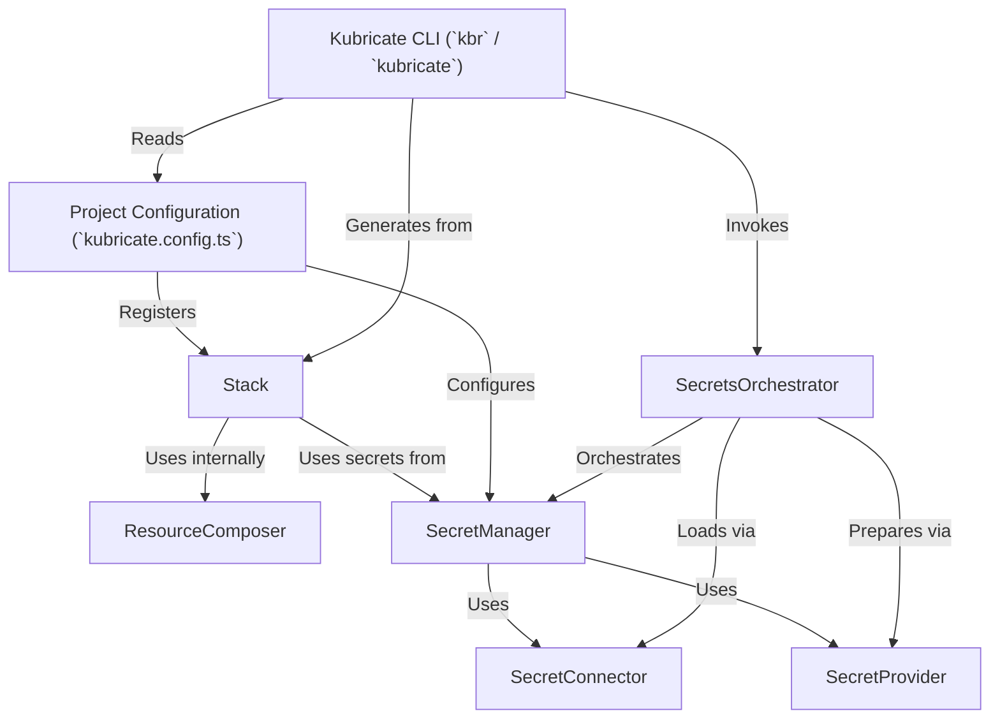

# Tutorial: kubricate

Kubricate is a TypeScript framework that simplifies creating and managing Kubernetes configurations *without complex YAML*.
It uses reusable **Stacks** as blueprints for your applications and infrastructure, promoting consistency.
Kubricate also offers declarative **Secret Management**, where you define *what* secrets you need, and let **Connectors** fetch them from sources like `.env` or cloud vaults, while **Providers** prepare them for Kubernetes injection.
You interact with Kubricate primarily through its **CLI** (`kbr`) to generate manifests and manage the secret lifecycle based on the central **Project Configuration**.

**Source Repository:** [None](None)

## Chapters

1. [Kubricate CLI (`kbr` / `kubricate`)
](01_kubricate_cli___kbr_____kubricate___.md)
2. [Project Configuration (`kubricate.config.ts`)
](02_project_configuration___kubricate_config_ts___.md)
3. [Stack
](03_stack_.md)
4. [SecretManager
](04_secretmanager_.md)
5. [SecretConnector
](05_secretconnector_.md)
6. [SecretProvider
](06_secretprovider_.md)
7. [SecretsOrchestrator
](07_secretsorchestrator_.md)
8. [ResourceComposer
](08_resourcecomposer_.md)

---

Generated by [AI Codebase Knowledge Builder](https://github.com/The-Pocket/Tutorial-Codebase-Knowledge)